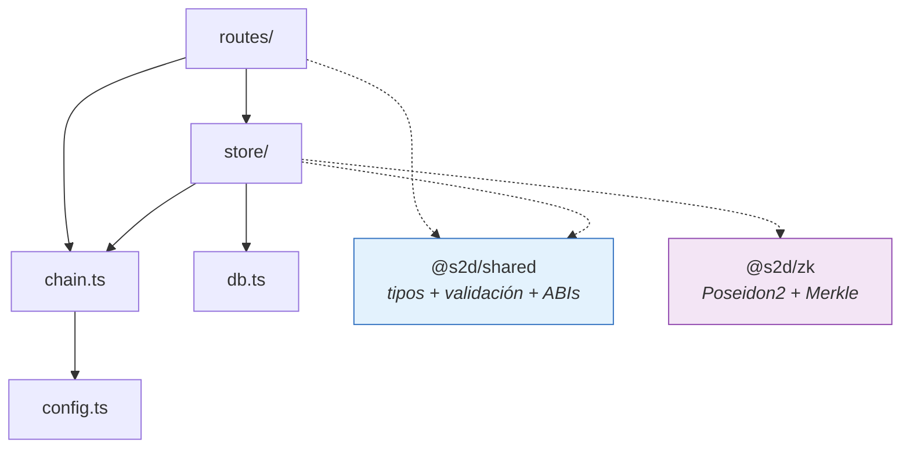

# Backend — Seed 2 Deed

API del expediente de proyectos, emisión de credenciales KYC, firma de
attestations e indexado de la cadena.

**Stack:** Fastify 5 · `node:sqlite` · viem · TypeScript
**Puerto:** `4000` · **29 endpoints** → [`../docs/api.md`](../docs/api.md)

---

## Arrancar

La red la define `backend/.env` (plantilla: `.env.example`). Hoy apunta a
**HashKey Chain Testnet (133)**, con los contratos desplegados y la base
sembrada:

```bash
npm install                      # desde la raíz del monorepo
npm run dev:backend              # :4000
```

En local con Anvil (`CHAIN_ID=31337`, o sin `.env`):

```bash
npm run chain                    # Anvil en :8545
npm run contracts:deploy:local
npm run seed -- --reset
npm run dev:backend              # :4000
```

```bash
curl localhost:4000/api/health
```

Sin cadena el servidor **arranca igual**: la API de dossiers sirve, y todo lo que
toca contratos devuelve un `503` con un mensaje accionable en vez de un
`undefined` que explota tres capas más abajo.

### Sin paso de compilación en desarrollo

```json
"dev":  "node --env-file-if-exists=.env --watch --experimental-strip-types src/index.ts"
```

Node 20+ borra los tipos y ejecuta el TypeScript directo. No hay `tsc` en el
loop de desarrollo. Todos los scripts (`dev`, `seed`, `e2e`, `fund`) cargan
`backend/.env` si existe.

> ⚠️ **El type-stripping tiene límites.** No soporta *parameter properties*
> (`constructor(readonly x: string)`), `enum`, ni `namespace`. Si escribís alguno
> de esos, el arranque falla con `ERR_UNSUPPORTED_TYPESCRIPT_SYNTAX`.
>
> Por eso `DomainError` declara sus campos aparte y los enums del dominio son
> objetos `as const`.

Para verificar tipos: `npx tsc -p tsconfig.json --noEmit`

---

## Mapa de módulos

```text
src/
├── index.ts              servidor, CORS, traductor de errores → HTTP
├── config.ts             env + lectura de deployments/<chainId>.json
├── db.ts                 esquema SQL y conexión
├── chain.ts              clientes viem, EIP-712, confirmaciones, lectura de eventos
├── demo-accounts.ts      cuentas demo: Anvil en 31337, DEMO_*_KEY en otras redes
├── seed.ts               siembra la demo completa           (T15)
├── e2e.ts                flujo end-to-end contra la cadena  (T16)
├── fund-demo.ts          recarga gas nativo a las cuentas demo (redes públicas)
├── routes/
│   ├── projects.ts       dossier, revisión, publicación, evidencia
│   ├── investors.ts      inversionistas, KYC, credenciales, circuito
│   ├── verification.ts   firma de hitos y transmisión       (T10)
│   └── repayment.ts      calendario de repago y confirmación de cuotas
└── store/
    ├── projects.ts       CRUD, máquina de estados, evidencia
    ├── investors.ts      árbol de credenciales del emisor
    ├── attestations.ts   firma EIP-712
    ├── indexer.ts        sincronización con la cadena
    ├── waterfall.ts      cálculo de cuotas de repago
    └── ipfs.ts           anclaje opcional de evidencia (Pinata)

scripts/
├── connectivity-check.mjs   npm run check:conn (raíz) — 27 verificaciones por el proxy de Vite
└── kyc-check.mjs            alta de inversionista de punta a punta
```

### Dependencias entre capas



**`routes/` no habla con `db.ts` directamente.** Toda escritura pasa por
`store/`, que es donde viven las reglas: qué se puede editar, qué transición es
legal, qué hash se calcula sobre qué.

---

## Las cuatro reglas que hay que conocer antes de tocar nada

### 1 · Los montos son `string`, y en SQLite son `TEXT`

```ts
BigInt(project.terms.target)     // ✓
Number(project.terms.target)     // ✗ nunca
```

SQLite guarda enteros de 64 bits con signo. Cuando se desborda **no avisa**: lo
convierte silenciosamente a float y el descuadre aparece meses después.

### 2 · El dossier se congela al salir de borrador

```ts
EDITABLE_STATUSES = ['DRAFT', 'CHANGES_REQUESTED']
```

`updateProject` revienta fuera de ahí. Un expediente no cambia bajo los pies de
quien lo evalúa, ni mucho menos con capital adentro.

Para los campos que **sí** se escriben después —calificación de riesgo, raíz de
credenciales, dirección del vault— existe `setPlatformFields`, acotado a cinco
campos. No son ediciones del desarrollador: son del operador.

### 3 · De `FUNDING` en adelante manda la cadena

El indexador lee `projects()` del vault y llama a `transition(..., { force: true })`.
**El backend refleja, no decide.** `force` no está expuesto en ninguna ruta HTTP.

### 4 · Los hashes se calculan en el servidor, nunca se aceptan del cliente

```ts
const sha256 = createHash('sha256').update(content).digest('hex');
```

Aceptar el hash del cliente sería dejar que quien sube la evidencia **elija qué
se firma**.

---

## Cómo extender

### Agregar un endpoint

1. La regla de negocio va en `store/`, no en la ruta.
2. Los errores se lanzan como `DomainError(mensaje, código, detalles)`.
3. Registrá la ruta en el plugin que corresponda.

```ts
// store/projects.ts
export function archiveProject(id: string): ProjectDossier {
  const project = getProject(id);
  if (!project) throw new DomainError('Proyecto inexistente', 404);
  if (CAPITAL_AT_RISK_STATUSES.includes(project.status)) {
    throw new DomainError('No se archiva un proyecto con capital comprometido.', 409);
  }
  // …
}

// routes/projects.ts
app.post('/api/projects/:id/archive', async (request) => {
  const { id } = request.params as { id: string };
  return { project: archiveProject(id) };
});
```

**No hace falta `try/catch`.** El traductor de `index.ts` mapea `DomainError`,
`ChainUnavailableError` y los reverts de viem a su código HTTP. Sin ese traductor
central, tarde o temprano una ruta deja escapar un stack trace con la ruta del
filesystem — o peor, responde `200` con un cuerpo de error.

### Escribir mensajes de error

El estándar de la casa: **decí qué pasó y qué hacer**, no solo que falló.

```ts
// ✗
throw new DomainError('Estado inválido', 409);

// ✓
throw new DomainError(
  `No se puede pasar de ${current.status} a ${to}. Desde ${current.status} solo se puede ir a: ${TRANSITIONS[current.status].join(', ')}.`,
  409,
);
```

### Agregar una tabla

Agregala a `SCHEMA` en `db.ts` con `CREATE TABLE IF NOT EXISTS`. Se aplica al
arrancar. **No hay sistema de migraciones**: para cambiar una tabla existente,
hoy hay que borrar la base y re-sembrar.

Agregala también a `resetDb()`, en orden inverso a las foreign keys.

### Cambiar el dossier

El tipo vive en `packages/shared/src/dossier.ts`, no acá. Después:

```bash
npm run build -w @s2d/shared
```

El dossier se guarda como JSON, así que agregar un campo opcional no rompe las
filas viejas. Un campo **obligatorio** sí: hay que re-sembrar o escribir una
migración a mano.

### Tocar los contratos

```bash
npm run contracts:build
node scripts/sync-abi.mjs        # regenera packages/shared/src/abi.generated.ts
npm run build -w @s2d/shared
```

Nunca edites `abi.generated.ts`. Un ABI desincronizado da transacciones que
revierten sin decir por qué.

---

## Firmar attestations

`store/attestations.ts` valida **antes** de firmar: que el firmante esté
registrado en el proyecto y que su rol coincida con el del hito. El contrato lo
rechazaría igual; se corta acá para no gastar gas.

Se firma el **hash del paquete de evidencia**, no un texto libre:

```ts
const evidenceHash = evidenceBundleHash(project.id, milestoneIndex);
```

Sin eso, el verificador firma «apruebo el hito 3» y después nadie puede demostrar
**contra qué** firmó. Con eso, cambiar una foto del informe invalida la
acreditación entera.

> ⚠️ **`verifierKey` viaja en el cuerpo de la request SOLO en la demo.**
>
> En producción la firma se produce en la wallet del verificador —Metamask,
> hardware wallet, multisig— y acá llega firmada. Una plataforma que custodia las
> llaves de sus verificadores **puede acreditar sus propios hitos**, y toda la
> separación entre operar y acreditar se vuelve decorativa.
>
> El hueco para el camino correcto ya existe: `POST /api/attestations` devuelve
> `501`.

### Firmar y transmitir son dos actos distintos

`POST /api/attestations/:digest/submit` es una **comodidad**, no una llave.
`releaseMilestone` autoriza por la firma y no por el remitente: cualquiera puede
transmitirla. Si este servidor se cae, un tramo ya firmado sigue siendo liberable.

En el `e2e`, las liberaciones las envía el desarrollador, no el operador.

---

## Credenciales: lo que el servidor NO guarda

Al emitir una credencial, el backend recibe jurisdicción, patrimonio y
vencimiento, calcula la hoja, la inserta en el árbol… y **se queda solo con la
hoja**. El secreto y los atributos se devuelven una vez y el titular los guarda.

```sql
CREATE TABLE credentials (
  leaf  TEXT NOT NULL,   -- Poseidon2(secret, jurisdiction, net_worth, expires_at)
  ...                    -- ningún atributo en claro
);
```

Si se pierde el secreto, se re-emite; no hay recuperación. **Eso es la propiedad,
no el defecto:** lo que el servidor no tiene no se le puede filtrar, ni pedir por
orden judicial, ni vender.

Revocar pone la hoja en `0`. **No se compacta el array**: mover las demás
invalidaría el camino de autenticación de todos los otros titulares.

---

## El indexador

`store/indexer.ts` · cada 4 s · `startSyncLoop()`

| Decisión | Por qué |
|----------|---------|
| PK = `txHash:logIndex` | Único e inmutable en la cadena. Reprocesar un rango —reinicio, reorg corta, cursor mal guardado— **no duplica nada** |
| Lee `projects()`, no reconstruye desde eventos | El estado actual es un dato único y autoritativo; reconstruirlo desde una secuencia se desincroniza en cuanto falta un evento |
| Nunca escribe a la cadena | Se puede reconstruir entero borrando `chain_events` |
| Un error de red no tumba el servidor | La cadena puede estar caída y la API de dossiers sigue sirviendo |
| Arranca desde `deployment.blockNumber` | Escanear desde el bloque 0 en una red real son millones de bloques de nada |

Forzar una pasada: `POST /api/sync`

---

## Redes públicas

Anvil perdona cosas que un nodo público no. Lo que cambia fuera de 31337:

| Diferencia | Cómo lo resuelve el backend |
|------------|-----------------------------|
| El RPC **no firma** (`unknown account`) | Toda escritura firma localmente con una cuenta de viem (`privateKeyToAccount`) |
| Nonces repetidos en tx seguidas | `nonceManager` de viem: el nonce se lleva en memoria, no se le pregunta al nodo |
| Lecturas desactualizadas: el RPC de HashKey está detrás de Cloudflare y otro nodo puede no haber visto la tx | `CONFIRMATIONS = 2` fuera de Anvil (1 en Anvil) |
| La cadena persiste entre corridas | `seed` y `e2e` buscan un `onChainId` libre en el vault |
| Las cuentas nacen sin gas | `npm run fund:demo` recarga cada rol hasta un piso |
| Las llaves de Anvil son públicas | `demo-accounts.ts` exige `DEMO_<ROL>_KEY` y avisa si falta alguna |

---

## Configuración

Se lee de `backend/.env`. Plantilla con los valores de HashKey Testnet en
`backend/.env.example`.

| Variable | Default | HashKey Testnet |
|----------|---------|-----------------|
| `PORT` | `4000` | |
| `HOST` | `127.0.0.1` | |
| `CHAIN_ID` | `31337` | `133` |
| `RPC_URL` | `http://127.0.0.1:8545` | `https://testnet.hsk.xyz` |
| `DB_PATH` | `backend/data/seed2deed.db` | |
| `CORS_ORIGINS` | `http://localhost:5173,http://127.0.0.1:5173` | |
| `LOG_LEVEL` | `info` | |
| `OPERATOR_PRIVATE_KEY` | cuenta 0 de Anvil | La llave que desplegó los contratos |
| `DEMO_DEVELOPER_KEY`, `DEMO_LEGAL_KEY`, `DEMO_SUPERVISOR_KEY`, `DEMO_INVESTOR_{A,B,C,D}_KEY` | llaves de Anvil | Llaves propias (`cast wallet new`) |
| `PINATA_JWT` | — | Opcional: sin él, anclar en IPFS devuelve `null` sin fallar |

`CHAIN_ID` tiene que coincidir con `VITE_CHAIN_ID` del frontend, y tiene que
existir `contracts/deployments/<CHAIN_ID>.json`.

### ⚠️ La llave del operador

En local es la cuenta 0 de Anvil, cuyo mnemónico es **público y está en la
documentación de Foundry**. En testnet es la llave del desplegador: solo esa
puede crear proyectos, dar KYC y fijar políticas.

En producción esto **no** es una variable de entorno con una llave adentro: es
una firma delegada a un KMS o a una multisig. Un backend que puede firmar como
operador y además está expuesto a internet es **un único servidor comprometido de
distancia** respecto de poder crear proyectos falsos.

---

## Base de datos

9 tablas → [`../docs/esquemas.md`](../docs/esquemas.md#2--persistencia--sqlite)

```bash
sqlite3 backend/data/seed2deed.db ".tables"
sqlite3 backend/data/seed2deed.db "SELECT id, name, status FROM projects"
```

El dossier va como JSON en una columna: es un documento anidado que se lee entero
o no se lee. Lo que **sí** está normalizado es lo que se consulta, filtra o
audita por separado: evidencias, attestations, credenciales, eventos.

`backend/data/` está en `.gitignore`.

---

## Probar

```bash
npm run e2e                              # flujo completo contra la cadena
npx tsc -p tsconfig.json --noEmit        # tipos
npm run check:conn                       # desde la raíz, con backend y frontend corriendo
```

En testnet el `e2e` consume HSK del operador (~0,015 por corrida) y crea
proyectos nuevos en el vault: no correrlo por reflejo.

El `e2e` es hoy la prueba de integración del backend: ejercita el store, la firma
de attestations, el árbol de credenciales y el indexador contra contratos reales.

**No hay tests unitarios.** El hueco más valioso a llenar: las transiciones de
estado de `store/projects.ts` y las reglas de `@s2d/shared/validate`, que son
lógica pura y se testean sin cadena.

---

## Lo que falta

| Falta | Nota |
|-------|------|
| **Autenticación** | **No hay ninguna. Todas las rutas son abiertas.** Antes de exponer esto hace falta auth por wallet (SIWE) y autorización por rol |
| Rate limiting | |
| Esquemas JSON en las rutas | Fastify los soporta; hoy las rutas castean el cuerpo |
| Migraciones | Cambiar una tabla exige borrar la base |
| Recepción de firmas externas | `POST /api/attestations` → `501` |
| Tests unitarios | Ver arriba |
| Almacenamiento de evidencia | Se guarda el hash y los metadatos; el archivo no se persiste (T18: IPFS) |
| OpenAPI | |

---

## Ver también

| | |
|---|---|
| [`../docs/api.md`](../docs/api.md) | Los 29 endpoints con ejemplos |
| [`../docs/esquemas.md`](../docs/esquemas.md) | Esquema SQL y del dossier |
| [`../docs/arquitectura.md`](../docs/arquitectura.md) | Cómo encaja el backend en el sistema |
| [`../docs/zk.md`](../docs/zk.md) | Credenciales y pruebas |
| [`../docs/operacion.md`](../docs/operacion.md) | Despliegue y troubleshooting |
