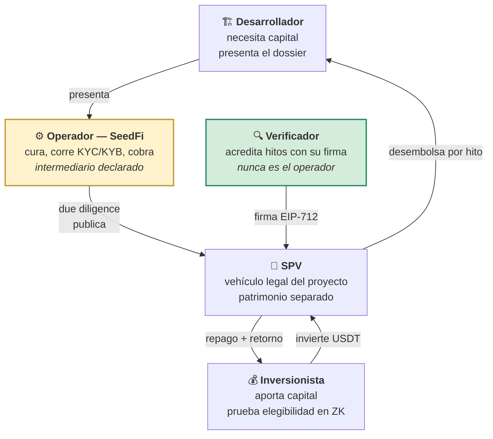
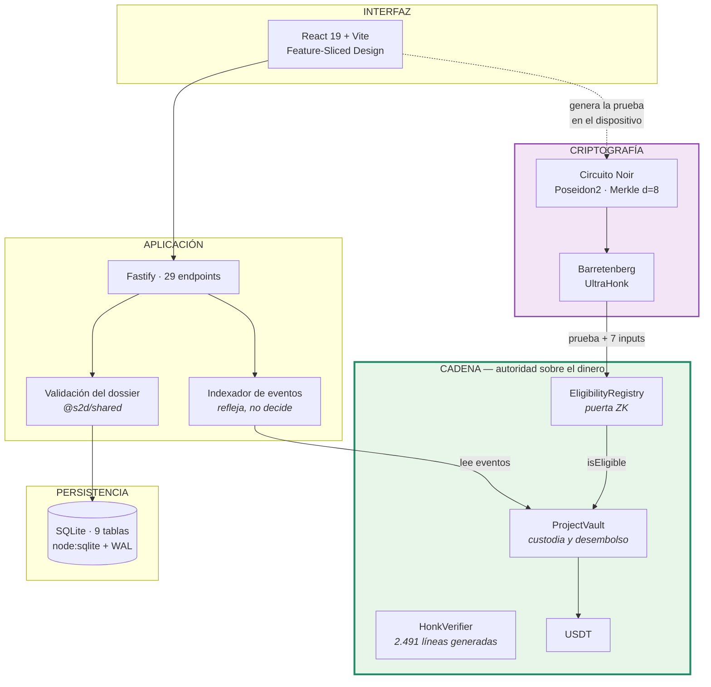
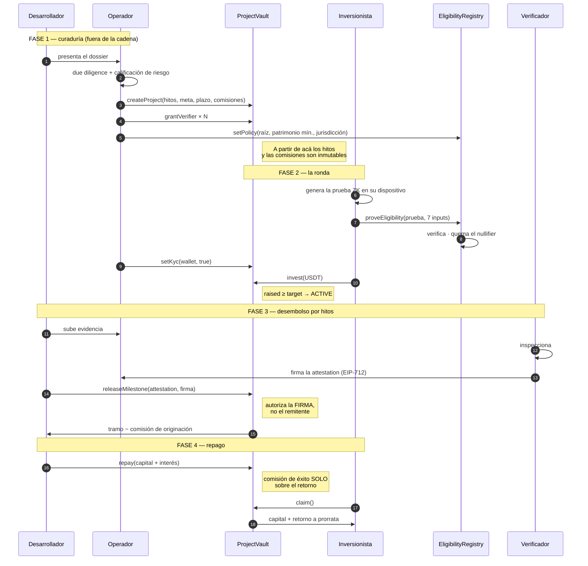
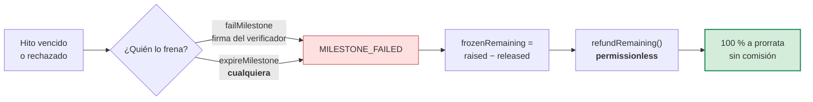

# Arquitectura

## 1. El problema, en una frase

Financiar una obra exige que alguien entregue capital hoy contra una promesa de
que mañana habrá un edificio. En Bolivia y en la región, esa promesa se sostiene
sobre confianza personal: el inversionista no puede verificar el avance, no sabe
en qué se gastó su plata, y si el proyecto se cae no tiene mecanismo para frenar
el desembolso de lo que todavía no salió.

SeedFi no inventa confianza. **Reemplaza los tramos donde la confianza era
la única garantía por mecanismos que no requieren confiar.**

---

## 2. Los cinco actores



> **El verificador no puede ser el operador.** `grantVerifier` lo rechaza por
> construcción:
> ```solidity
> if (verifier == operator || verifier == feeRecipient) revert VerificadorNoPuedeSerElOperador();
> ```
> Sin esa línea, el operador se autodesigna verificador y la garantía 2 del
> README se vuelve falsa.

---

## 3. Capas



### Quién manda sobre qué

| Dominio | Autoridad | Consecuencia |
|---------|-----------|--------------|
| El dinero | **La cadena** | El backend puede caerse: el capital sigue ahí y los hitos ya firmados siguen liberándose |
| La elegibilidad | **El circuito** | Ni el operador puede fabricarla |
| El expediente | La plataforma | Es curaduría, y se declara como tal |
| El estado del proyecto | Mixto | Hasta `PUBLISHED` manda la plataforma; de `FUNDING` en adelante, la cadena |

---

## 4. Flujo completo



### El camino que importa: cuando sale mal



`expireMilestone` y `refundRemaining` son **permissionless** a propósito. Si el
freno dependiera de que el operador, la constructora o el verificador reconozcan
el incumplimiento, bastaría con que uno de ellos desaparezca para dejar el
capital atrapado para siempre.

---

## 5. Decisiones de diseño

### 5.1 El escrow libera por tramos, no de una vez

Un escrow que entrega el 100 % al cerrar la ronda es una transferencia bancaria
con pasos extra. El control existe porque **queda capital adentro**: si el hito 3
falla, lo de los hitos 4 y 5 vuelve al inversionista.

Por eso el validador marca un warning cuando el primer tramo supera el 40 %.

### 5.2 El verificador acredita un hecho, no negocia un monto

`Attestation` **no lleva monto**. El tramo quedó fijado al crear el proyecto.

```solidity
struct Attestation {
    uint256 projectId;
    uint8   milestoneIndex;
    bytes32 evidenceHash;   // ← contra QUÉ firmó
    bool    approved;
    uint256 nonce;
    uint64  expiresAt;
}
```

`evidenceHash` es lo que hace que la firma signifique algo. Sin él, el
verificador firma «apruebo el hito 3» y después nadie puede demostrar contra qué
firmó. Con él, cambiar una foto del informe invalida la acreditación entera.

### 5.3 Firmar y transmitir son dos actos distintos

`releaseMilestone` autoriza por la **firma**, no por el remitente. Cualquiera
puede mandar la transacción: el desarrollador, un inversionista, un script.

> Si SeedFi desaparece mañana, una attestation ya firmada sigue liberando
> su tramo. **El backend es una comodidad, no una llave.**

En el `e2e`, las liberaciones las envía el desarrollador, no el operador.

### 5.4 Dos filtros distintos para entrar a una ronda

```text
   kycApproved       ← lo que el operador AFIRMA (y podría mentir)
        +               su obligación regulatoria como intermediario
   isEligible        ← lo que el inversionista PRUEBA (nadie lo fabrica)
        =               jurisdicción + patrimonio + credencial vigente
   puede invertir
```

No son redundantes: uno depende de la buena fe del operador y el otro no depende
de nadie. El gate se conectó como cambio **aditivo** (`eligibilityGate == 0` deja
la puerta abierta), para no tocar el bytecode ya probado del vault.

### 5.5 La plataforma cobra del flujo, nunca del capital reembolsable

```text
   originationBps  ≤  300 bps    sobre cada tramo LIBERADO
   successBps      ≤ 2000 bps    sobre el RETORNO, jamás sobre el capital
   reembolsos                    0 — la plataforma no cobra por fracasar
```

Mientras la constructora no haya devuelto todo el capital, la plataforma no gana
un centavo: **primero cobra el inversionista**. El `e2e` lo verifica con un
`assert` sobre la primera cuota.

### 5.6 Todo monto es entero

Ver [`esquemas.md`](esquemas.md#convenciones-que-atraviesan-todos-los-esquemas).
En el `e2e`, el reparto de 991.800 USDT entre tres inversionistas cierra con
**0 unidades** de polvo de redondeo.

### 5.7 El indexador refleja, no decide

Lee `projects()` del vault —un dato único y autoritativo— en vez de reconstruir
el estado desde una secuencia de eventos, que es exactamente el tipo de
reconstrucción que se desincroniza en cuanto falta uno.

Su clave primaria es `txHash:logIndex`: reprocesar un rango no duplica nada.

---

## 6. Qué NO hace este sistema

Decirlo explícitamente evita vender algo que el código no sostiene.

| No hace | Por qué |
|---------|---------|
| Registrar la propiedad del inmueble | Eso es Derechos Reales. El hash on-chain **no constituye** una garantía real |
| Verificar físicamente la obra | Un smart contract no puede mirar un edificio. Por eso existe el verificador humano |
| Reemplazar el contrato de inversión | El documento jurídico vive fuera; on-chain va su hash |
| Eliminar el riesgo del proyecto | Reduce el riesgo de **desvío de fondos**. Que el edificio se venda es otro riesgo |
| Resolver el encuadre regulatorio | Ver abajo |

### El riesgo real no es técnico

> ¿Puede la plataforma captar dinero de inversionistas y canalizarlo a proyectos
> inmobiliarios bajo el marco regulatorio aplicable?

ASFI contempla dentro de las ETF categorías de plataformas de financiamiento,
blockchain/activos tokenizados y PSAV, y existe un Entorno Controlado de Pruebas
(ECP) bajo su supervisión. El BCB habilitó en 2024 canales electrónicos de pago
para operaciones con activos virtuales.

La decisión estratégica que **sigue abierta** es qué recibe exactamente el
inversionista a cambio de su USDT: deuda, participación, revenue sharing o una
combinación. Esa definición determina buena parte de la estructura legal, y el
código está escrito para acomodar cualquiera de ellas — `repaymentModel` ya
distingue `BULLET`, `QUARTERLY_INTEREST` y `ON_SALE`.

---

## 7. Modelo de confianza, resumido

| Si esto pasa… | ¿Se pierde el capital? |
|---------------|------------------------|
| El backend se cae | **No.** Las attestations firmadas siguen siendo transmisibles por cualquiera |
| El operador se vuelve malicioso | **No.** No puede retirar, ni liberar, ni subir comisiones, ni fabricar elegibilidad |
| El verificador desaparece | **No.** `expireMilestone` es permissionless: el hito vence y el capital se devuelve |
| La ronda no llega a la meta | **No.** `refund` es permissionless y no depende de que nadie cierre la ronda |
| Un hito falla | **Parcial.** Vuelve el 100 % de lo **no liberado**; lo ya desembolsado está en la obra |
| La constructora no repaga | **Sí.** Esto es riesgo de crédito, y ningún contrato lo elimina |

La última fila es la honesta: el sistema controla el **desvío** de fondos, no el
**fracaso** de un negocio inmobiliario.
