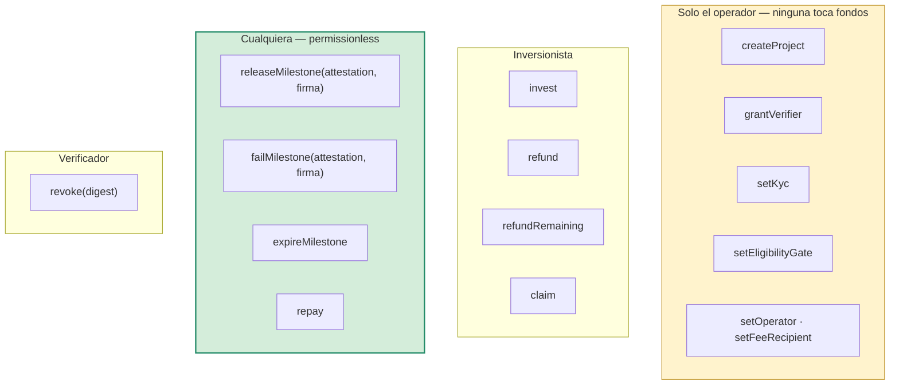
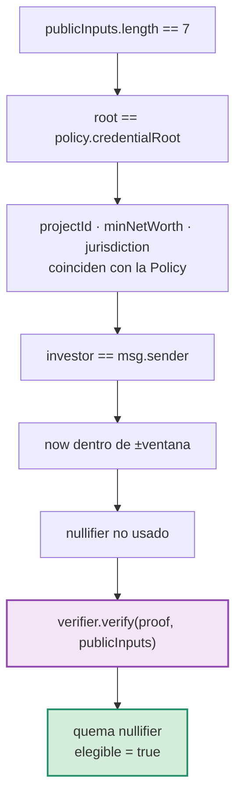

# Contratos

| Contrato | Archivo | Pragma | Rol |
|----------|---------|--------|-----|
| `ProjectVault` | `contracts/src/ProjectVault.sol` | `0.8.24` exacto | Custodia y desembolso por hitos |
| `EligibilityRegistry` | `contracts/src/EligibilityRegistry.sol` | `0.8.24` | Puerta de elegibilidad ZK |
| `HonkVerifier` | `contracts/src/verifiers/EligibilityVerifier.sol` | `^0.8.27` | Generado por barretenberg — 2.491 líneas |
| `MockUSDT` | `contracts/src/mocks/MockUSDT.sol` | `0.8.24` | Solo testnet |

**Sin OpenZeppelin.** EIP-712 y las transferencias seguras van implementadas a
mano para que `ProjectVault` compile con solc pelado, sin `forge install`.

> El pragma de `ProjectVault` está **clavado en `0.8.24`**, no en `^0.8.24`: lo
> que se audita es un bytecode concreto, no «lo que compile hoy». Eso choca con
> el `^0.8.27` que exige el verificador generado, y por eso el despliegue va en
> dos scripts. Ver [operacion.md](operacion.md#por-qué-el-despliegue-son-dos-pasos).

---

## ProjectVault

### Superficie



**Lo que NO existe, a propósito:**

```text
   withdraw()          ✗     pause()            ✗
   emergencyExit()     ✗     upgradeTo()        ✗
   setMilestones()     ✗     setFees()          ✗
```

No hay proxy. No hay `owner` que pueda mover capital. El operador registra y
configura; no toca un centavo.

### Funciones

| Firma | Quién | Nota |
|-------|-------|------|
| `createProject(uint256,address,uint256,uint64,Milestone[],uint16,uint16)` | operador | Σ bps debe dar 10 000; comisiones ≤ topes |
| `grantVerifier(uint256,address,uint8)` | operador | **Revierte si el verificador es el operador o el feeRecipient** |
| `setKyc(address,bool)` | operador | Tamizaje AML |
| `setEligibilityGate(address)` | operador | Solo endurece; en 0 la puerta queda abierta |
| `invest(uint256,uint256)` | inversionista | Exige KYC **y** elegibilidad ZK |
| `refund(uint256)` | inversionista | Ronda vencida sin llegar a la meta. Permissionless |
| `releaseMilestone(Attestation,bytes)` | **cualquiera** | Autoriza la firma, no el remitente |
| `failMilestone(Attestation,bytes)` | **cualquiera** | Con attestation `approved = false` |
| `expireMilestone(uint256)` | **cualquiera** | Hito vencido sin acreditar |
| `refundRemaining(uint256)` | inversionista | A prorrata, sin comisión. Permissionless |
| `repay(uint256,uint256)` | constructora | Acumulador: soporta cuotas parciales |
| `claim(uint256)` | inversionista | Pull-based |
| `revoke(bytes32)` | verificador | Anula una firma antes de que se use |
| `claimable(uint256,address)` | view | |
| `milestones(uint256)` | view | |
| `hashAttestation(Attestation)` | view | Digest EIP-712 |
| `domainSeparator()` | view | |

### Invariantes

| # | Invariante | Dónde se hace cumplir |
|---|------------|----------------------|
| 1 | `Σ milestone.bps == 10_000` | `createProject` → `HitosInvalidos()` |
| 2 | `originationBps ≤ 300` y `successBps ≤ 2000` | `createProject` → `ComisionExcesiva()` |
| 3 | El operador nunca es verificador | `grantVerifier` → `VerificadorNoPuedeSerElOperador()` |
| 4 | Los hitos se liberan **en orden, sin saltos** | `releaseMilestone` → `FueraDeOrden()` |
| 5 | Una attestation se usa **una vez** | `consumed[digest]` → `FirmaConsumida()` |
| 6 | El rol del firmante coincide con el del hito | `_consume` → `FirmanteNoAutorizado()` |
| 7 | Los reembolsos **no pagan comisión** | `refund` · `refundRemaining` — no calculan fee |
| 8 | La comisión de éxito nunca toca el capital | `repay` → `aRetorno = amount − aCapital` |
| 9 | `released + comisiones == raised` al completar | verificado con `assert` en el `e2e` |

### Detalles que parecen menores y no lo son

**`released` cuenta el bruto.** Si contara el neto, `frozenRemaining = raised −
released` daría de más y el contrato intentaría devolver capital que ya salió.

**El último hito barre el polvo.**
```solidity
uint256 amount = p.nextMilestone == _milestones[a.projectId].length
    ? p.raised - p.released              // el resto exacto
    : (p.raised * m.bps) / 10_000;
```
Sin esto, cinco divisiones enteras dejan unidades atrapadas para siempre.

**Una sola división en `claimable`.**
```solidity
uint256 total = (invested[projectId][user] * p.totalRepaid) / p.raised;
return total > claimed[projectId][user] ? total - claimed[...] : 0;
```
Un acumulador tipo `accPerUnit` trunca dos veces —al repagar y al reclamar— y
cuesta ~1 unidad por inversionista **por cuota**. Esta forma trunca una sola vez.

**`refund` no depende de un `closeRound()`.** Si el cierre dependiera de un
tercero, bastaría con que ese tercero desaparezca para dejar el capital atrapado.

**Firmas EIP-2 estrictas.** `_recover` rechaza `s` en la mitad alta de la curva:
sin eso, cada firma tiene una gemela maleable con otro digest.

**`_safeTransfer` tolera retorno vacío.** USDT real no devuelve `bool` en
`transfer`; con una interfaz ERC-20 estándar, todo revertiría.

---

## EligibilityRegistry

```solidity
struct Policy {
    bytes32 credentialRoot;
    uint256 minNetWorth;
    uint256 allowedJurisdiction;
    bool    configured;
}

uint64 public constant MAX_ANTIGUEDAD_PRUEBA = 30 minutes;
uint64 public constant TOLERANCIA_FUTURO     =  5 minutes;
```

| Firma | Quién |
|-------|-------|
| `setPolicy(uint256,bytes32,uint256,uint256)` | operador |
| `revokeEligibility(uint256,address,string)` | operador |
| `setOperator(address)` | operador |
| `proveEligibility(uint256,bytes,bytes32[])` | **el inversionista, con una prueba válida** |
| `isEligible(uint256,address)` | view |
| `policyOf(uint256)` | view |

> **No existe `setEligible`.** La única forma de entrar es `proveEligibility`, y
> esa puerta la abre la matemática del verificador.
>
> El operador puede fijar la política, cambiar la raíz y revocar a quien quiera —
> pero parado frente a la misma puerta que todos, **sin una prueba válida no
> entra ni él**. Está cubierto por `test_elOperadorNoPuedeFabricarElegibilidad`.

### Orden de las verificaciones



La prueba se verifica **al final**, después de los checks baratos: `verify`
cuesta cientos de miles de gas y no tiene sentido pagarlos para después rechazar
por una wallet que no coincide.

### Por qué cada check importa

| Sin este check… | Pasaría esto |
|-----------------|--------------|
| Inputs atados a la `Policy` | El prover elige `min_net_worth = 0` y prueba una trivialidad válida |
| `investor == msg.sender` | Cualquiera copia la prueba del mempool y se registra con ella |
| Ventana sobre `now` | «En 2020 yo era elegible» alcanza para entrar hoy con credencial vencida |
| Quemar el `nullifier` | Una credencial entra tantas veces como wallets tenga su dueño |

Revocar **no devuelve el nullifier**: sería un intento extra regalado.

---

## Modelo de amenaza

| Ataque | Defensa | Test |
|--------|---------|------|
| El operador se lleva el capital | No hay `withdraw` ni proxy | — (ausencia verificable) |
| El operador libera un hito | `grantVerifier` lo excluye | `test_momento1_niSiendoElOperadorPuedeLiberarFondos` |
| El operador se autodesigna verificador | Revierte | `test_operadorNoPuedeDesignarseVerificador` |
| El operador sube su comisión | Topes inmutables, fijados al crear | `test_comisionTopeadaEnCodigo` |
| Reenviar una attestation | `consumed[digest]` | `test_reenviarLaMismaAttestationNoLiberaDosVeces` |
| Firmar con el rol equivocado | `verifierRole != m.role` | `test_rolEquivocadoNoAcredita` |
| Saltarse un hito | `FueraDeOrden()` | `test_hitosSeLiberanEnOrdenSinSaltos` |
| Firma vieja reutilizada | `expiresAt` | `test_firmaVencidaNoSirve` |
| Verificador arrepentido | `revoke(digest)` | `test_verificadorPuedeRevocarAntesDeQueSeUse` |
| Capital atrapado si nadie cierra | `refund` permissionless | `test_refundNoDependeDeQueAlguienCierreLaRonda` |
| Verificador desaparecido | `expireMilestone` permissionless | `test_hitoVencidoLoFrenaCualquiera` |
| Cobrar comisión por fracasar | Los reembolsos no calculan fee | `test_elReembolsoNoPagaComision` |
| Comisión sobre el capital | Solo sobre el retorno | `test_comisionDeExitoNoTocaElCapital` |
| Operador fabricando elegibilidad | No existe `setEligible` | `test_elOperadorNoPuedeFabricarElegibilidad` |
| Prueba robada del mempool | Wallet atada al nullifier y a `msg.sender` | `test_pruebaRobadaDelMempoolNoSirve` |
| Sybil con una credencial | Nullifier quemado | `test_mismaCredencialNoEntraDosVecesConOtraWallet` |
| Umbral rebajado por el prover | Inputs atados a la `Policy` | `test_umbralRebajadoPorElProverNoPasa` |
| Prueba con reloj corrido | Ventana de ±30/5 min | `test_pruebaViejaNoSirve` · `test_pruebaConRelojAdelantadoNoSirve` |

**30 tests.** `npm run contracts:test`

---

## Lo que sigue siendo confianza

Hay que decirlo, porque el resto del documento dice lo contrario:

| Superficie | Riesgo |
|------------|--------|
| El verificador | Puede firmar en falso. Se mitiga con roles separados, matrícula profesional off-chain y `evidenceHash` — pero es una persona |
| La curaduría | Que el dossier refleje la realidad depende de la due diligence del operador |
| El riesgo de crédito | Que la constructora repague. Ningún contrato lo elimina |
| El SPV | Su eficacia depende de que esté bien constituido bajo derecho boliviano |
| La garantía real | El hash on-chain **no constituye** una hipoteca. Eso pasa por Derechos Reales |

Un modelo 2-de-3 entre auditor, oráculo y plataforma reduciría el primer riesgo
sin darle la llave al operador. El contrato ya soporta la estructura de roles;
falta la lógica de umbral.
