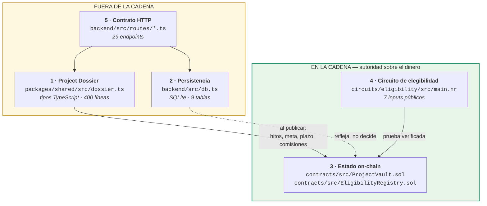
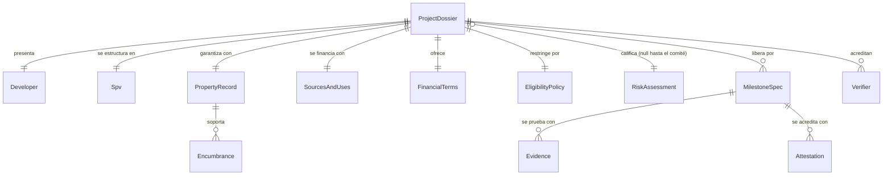
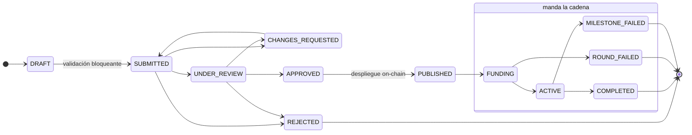
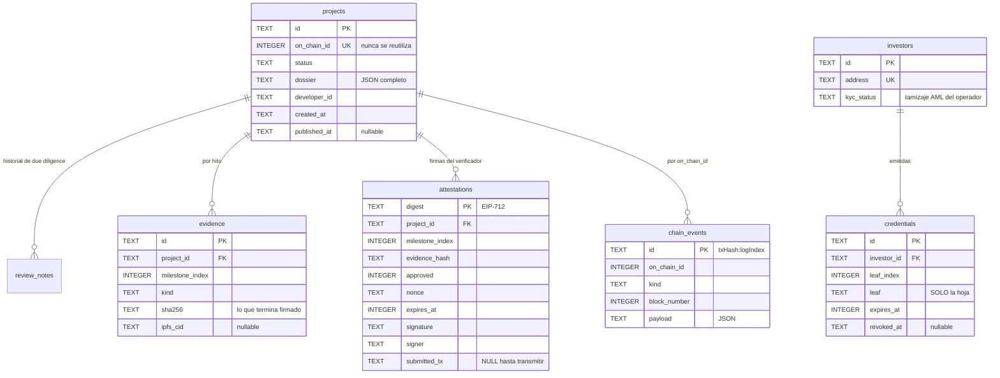

# Seed 2 Deed — Esquemas de datos

> Documento generado desde el código, no escrito aparte. Cada tabla de acá abajo
> lleva la ruta del archivo del que salió. Si algo no coincide, **manda el código**.

---

## 0. Mapa: dónde vive cada esquema

Hay cinco esquemas y viven en cinco lugares distintos. No es desprolijidad: cada
uno responde a una autoridad diferente, y confundirlas es de donde salen los
bugs caros.



| # | Esquema | Archivo | Quién manda |
|---|---------|---------|-------------|
| 1 | Project Dossier | `packages/shared/src/dossier.ts` | La plataforma |
| 2 | Persistencia | `backend/src/db.ts:31` | La plataforma |
| 3 | Estado on-chain | `contracts/src/ProjectVault.sol` | **La cadena** |
| 4 | Circuito ZK | `circuits/eligibility/src/main.nr:56` | **La matemática** |
| 5 | API HTTP | `backend/src/routes/` | La plataforma |

---

## Convenciones que atraviesan todos los esquemas

### Los montos son enteros en string. Siempre.

```text
   "900000000000"          ← 900.000 USDT, en unidades mínimas (6 decimales)
    900000.00              ← NUNCA. Prohibido en todo el sistema.
```

Un `number` de JavaScript es un `double` de 64 bits. `0.1 + 0.2 !== 0.3`, y un
capital de nueve cifras con seis decimales ya no cabe exacto. El monto que la UI
muestra tiene que ser, **bit por bit**, el que el contrato transfiere; cualquier
otra cosa termina en un descuadre que aparece meses después y que nadie sabe
explicar.

| Tipo | Definición | Ejemplo |
|------|-----------|---------|
| `Amount` | `string` — unidades mínimas, `BigInt` al operar | `"900000000000"` |
| `Bps` | `number` — puntos básicos, `10_000 = 100 %` | `1200` = 12 % |
| `Timestamp` | `string` — ISO-8601 UTC | `"2026-10-03T17:24:17.739Z"` |

Los **bps** existen para que casen exactamente con `ProjectVault.Milestone.bps`
y con los topes de comisión grabados en el bytecode. Un porcentaje en coma
flotante no puede sumar 100 % de forma confiable; 10 000 bps sí.

---

## 1 · Project Dossier

`packages/shared/src/dossier.ts`

El expediente del proyecto. Lo que un comité de crédito necesita ver **antes**
de dejar que alguien ponga plata — no el formulario de un marketplace.



### Raíz

| Campo | Tipo | Nota |
|-------|------|------|
| `id` | `string` | `S2D-xxxxxxxx` |
| `onChainId` | `number` | **Nunca se reutiliza.** En el vault, un id usado queda ocupado para siempre |
| `name` · `city` · `summary` | `string` | |
| `type` | `RESIDENCIAL \| COMERCIAL \| MIXTO \| INDUSTRIAL \| URBANIZACION` | |
| `status` | `ProjectStatus` | ver máquina de estados |
| `agreementHash` | `string \| null` | Hash del contrato de inversión firmado fuera de la cadena |
| `vaultAddress` · `chainId` | `string \| number \| null` | Se completan al publicar |

### `spv` — el vehículo legal

Existe para que el inversionista tenga un **patrimonio separado** contra el cual
reclamar: si la constructora quiebra por otra obra, este proyecto no se va con ella.

```text
legalName · taxId (NIT) · commercialRegistry · incorporatedAt
jurisdiction · treasuryAddress ← wallet destinataria de los desembolsos
```

### `property` — el inmueble

| Campo | Tipo | Nota |
|-------|------|------|
| `cadastralId` | `string` | Matrícula de Derechos Reales (folio real) |
| `landArea` · `buildableArea` | `number` | m² |
| `appraisedValue` · `appraisedAt` · `appraiser` | `Amount` · `Timestamp` · `string` | |
| `encumbrances[]` | `Encumbrance[]` | |
| `certificateVerifiedAt` | `Timestamp \| null` | |

> ⚠️ **`encumbrances: []` NO significa «libre de gravámenes».** Significa
> «nadie declaró ninguno». La diferencia la marca `certificateVerifiedAt`, y
> por eso el validador lo exige como error bloqueante.

`Encumbrance`: `type` (`HIPOTECA | ANOTACION_PREVENTIVA | SERVIDUMBRE | EMBARGO | OTRO`) ·
`holder` · `amount` · **`rank`** · `registeredAt`.

`rank: 1` = ese acreedor **cobra antes que los inversionistas** en una ejecución.

### `sourcesAndUses` — la invariante que sostiene todo

```text
              FUENTES                              USOS
    ┌──────────────────────────┐      ┌──────────────────────────────┐
    │ developerEquity          │      │ land                         │
    │ investorFinancing   ─────┼──┐   │ construction                 │
    │ bankFinancing            │  │   │ permitsAndFees               │
    │ presales                 │  │   │ professionalServices         │
    └──────────┬───────────────┘  │   │ marketing                    │
               │                  │   │ contingency                  │
               │                  │   │ financialCosts               │
               │                  │   └──────────────┬───────────────┘
               ▼                  │                  ▼
         Σ fuentes        debe ser │ ≥         Σ usos
                                  │
                                  └──► debe ser IGUAL a terms.target
```

Si las fuentes no cubren los usos, el proyecto tiene un hueco que alguien va a
tener que tapar — y ese alguien termina siendo el inversionista.

### `terms` — condiciones financieras

| Campo | Tipo | Tope |
|-------|------|------|
| `target` | `Amount` | = `sources.investorFinancing` |
| `minimumTicket` · `maximumTicket` | `Amount` · `Amount \| null` | |
| `termMonths` | `number` | |
| `interestBps` | `Bps` | 1200 = 12 % anual |
| `repaymentModel` | `BULLET \| QUARTERLY_INTEREST \| ON_SALE` | |
| `originationBps` | `Bps` | **≤ 300** — grabado en el bytecode |
| `successBps` | `Bps` | **≤ 2000** — solo sobre el retorno |
| `expectedRevenue` · `fundingDeadline` | | |

### `milestones[]` — el corazón del escrow

| Campo | Tipo | Nota |
|-------|------|------|
| `index` | `number` | Se liberan **en orden estricto**, sin saltos |
| `bps` | `Bps` | **Σ debe dar exactamente 10 000** |
| `role` | `LEGAL \| SUPERVISOR` | Un abogado no acredita avance de obra |
| `deadline` | `Timestamp` | Vencido sin acreditar → cualquiera congela |
| `requiredEvidence` | `string[]` | Se pacta **antes**, no cuando toca cobrar |

Estados en runtime: `PENDING → IN_REVIEW → RELEASED | REJECTED | EXPIRED`

### `risk` — calificación del comité

Pesos del documento general §36. Suman 100.

```text
legal          ████████████████████  20 %
financial      ████████████████████  20 %
developer      ███████████████       15 %
market         ███████████████       15 %
property       ███████████████       15 %
construction   ██████████            10 %
liquidity      █████                  5 %
```

| Total | Nota |
|-------|------|
| ≥ 85 | `A+` |
| ≥ 70 | `A` |
| ≥ 55 | `B` |
| ≥ 40 | `C` |
| < 40 | `D` |

### `eligibility` — política ZK de la ronda

```text
minNetWorth          patrimonio mínimo exigido
allowedJurisdiction  ISO-3166 numérico (Bolivia = 68)
credentialRoot       raíz del árbol del emisor KYC al abrir la ronda
```

---

## Máquina de estados del proyecto

`backend/src/store/projects.ts` — escrita como tabla y no como `if`s
desparramados, porque **este grafo ES la política de la plataforma**.



Dos cortes importantes:

- **`EDITABLE_STATUSES = ['DRAFT', 'CHANGES_REQUESTED']`.** Fuera de ahí el
  dossier está congelado: no puede cambiar bajo los pies de quien lo evalúa, ni
  mucho menos con capital adentro.
- **De `FUNDING` en adelante la autoridad es la cadena.** El indexador lee
  `projects()` del vault y alinea; el backend refleja, no discute. Por eso
  existe `setPlatformFields`, acotado a cinco campos que son del operador
  (calificación de riesgo, raíz de credenciales, dirección del vault) y que se
  escriben *después* del congelamiento sin abrirle un agujero.

---

## Reglas de validación

`packages/shared/src/validate.ts` — cada regla corresponde a una forma concreta
en que un proyecto mal armado le cuesta plata a alguien.

| Severidad | Regla | Por qué |
|-----------|-------|---------|
| 🔴 ERROR | Σ `bps` ≠ 10 000 | El contrato lo rechaza; mejor un mensaje legible que gas quemado |
| 🔴 ERROR | Hito con `bps = 0` | |
| 🔴 ERROR | Hito sin `requiredEvidence` | El verificador firmaría lo que le pongan enfrente |
| 🔴 ERROR | Plazos de hitos fuera de orden | El hito 2 vencería esperando el 1 y el capital se congela **sin que nadie incumpla** |
| 🔴 ERROR | Σ fuentes < Σ usos | El hueco lo termina tapando el inversionista |
| 🔴 ERROR | `terms.target` ≠ `sources.investorFinancing` | El vault levanta una cifra y el presupuesto asume otra |
| 🔴 ERROR | `originationBps > 300` / `successBps > 2000` | El despliegue revierte |
| 🔴 ERROR | Primer hito vence antes del cierre de ronda | Nadie acredita obra con el capital sin recaudar |
| 🔴 ERROR | Rol exigido sin verificador registrado | Esos hitos vencerían sin poder acreditarse |
| 🔴 ERROR | `certificateVerifiedAt === null` | «Sin gravámenes declarados» ≠ «libre de gravámenes» |
| 🟡 WARN | Primer hito > 40 % del capital | El escrow deja de ser un control |
| 🟡 WARN | Contingencia < 5 % | El primer sobrecosto se come el tramo siguiente |
| 🟡 WARN | Equity del desarrollador < 10 % | Sin skin in the game, el riesgo lo carga entero el inversionista |
| 🟡 WARN | Gravamen de primer rango | El inversionista tiene que verlo **antes** de poner la plata |

> La validación bloqueante corre **al salir del borrador** (`→ SUBMITTED`), que
> es el último momento en que corregir es barato. Después ya hay un vault
> desplegado.

---

## 2 · Persistencia — SQLite

`backend/src/db.ts:31` · 9 tablas · `node:sqlite` con WAL



Más `issuer_state` (raíz vigente, fila única) y `sync_cursor` (último bloque
indexado, fila única).

### Tres decisiones de esquema que vale la pena justificar

**Los montos son `TEXT`, no `INTEGER`.** SQLite guarda enteros de 64 bits con
signo: 9,22 × 10¹⁸ como techo. Los acumulados de repago de una cartera entera
pueden pasarlo, y cuando se desborda **nadie se entera**: SQLite lo convierte
silenciosamente a float. `TEXT` + `BigInt` no tiene techo ni pierde un centavo.

**El dossier va como JSON en una columna.** Es un documento anidado que se lee
entero o no se lee; normalizarlo en quince tablas para volver a unirlas en cada
lectura no compra nada. Lo que **sí** está normalizado es todo lo que se
consulta, filtra o audita por separado: evidencias, attestations, credenciales,
eventos.

**`credentials.leaf` guarda solo la hoja.** El secreto, el patrimonio y la
jurisdicción se entregan **una vez** al titular y el servidor no los guarda. Lo
que no está no se filtra, ni se pide por orden judicial, ni se vende.

**`chain_events.id = "txHash:logIndex"`** es único e inmutable en la cadena, así
que reprocesar un rango —por un reinicio, una reorg corta, un cursor mal
guardado— no duplica nada.

---

## 3 · Estado on-chain

`contracts/src/ProjectVault.sol` — Solidity `0.8.24`, sin dependencias externas.

```solidity
enum Role   { NONE, LEGAL, SUPERVISOR }
enum Status { NONE, FUNDING, ACTIVE, COMPLETED, ROUND_FAILED, MILESTONE_FAILED }

struct Milestone {
    uint16 bps;        // porción del capital RECAUDADO
    Role   role;       // qué rol debe acreditarlo
    uint64 deadline;   // vencido sin acreditar => cualquiera puede frenar
    bool   released;
}

struct Project {
    address builder;
    uint256 target;
    uint64  endDate;
    uint256 raised;
    uint256 released;          // BRUTO, para que frozenRemaining sea exacto
    uint8   nextMilestone;
    Status  status;
    uint256 totalRepaid;       // acumulador: soporta cuotas parciales
    uint256 frozenRemaining;   // capital no liberado al momento de fallar
    uint16  originationBps;
    uint16  successBps;
}

struct Attestation {           // lo que firma el verificador (EIP-712)
    uint256 projectId;
    uint8   milestoneIndex;
    bytes32 evidenceHash;      // hash del PAQUETE de evidencia
    bool    approved;
    uint256 nonce;
    uint64  expiresAt;
}
```

`Attestation` **no incluye monto**: el tramo ya quedó fijado al crear el
proyecto. El verificador acredita un **hecho**, no negocia cuánto se libera.

### Topes inmutables

```solidity
uint16 public constant MAX_ORIGINATION_BPS = 300;   //  3 % del tramo liberado
uint16 public constant MAX_SUCCESS_BPS     = 2000;  // 20 % del RETORNO
```

Grabados en el bytecode. El operador elige por debajo al crear el proyecto;
nadie los sube después, ni él.

### Mappings

| Mapping | Para qué |
|---------|----------|
| `projects` · `_milestones` | Estado del proyecto |
| `verifierRole[pid][addr]` | Verificadores **por proyecto**. La llave del operador no está acá |
| `invested` · `claimed` | Posición de cada inversionista |
| `tookRoundRefund` · `tookRemainingRefund` | Anti doble reembolso |
| `consumed` · `revoked` | Anti-replay de firmas |
| `kycApproved` | Lo que el operador **afirma** |
| `eligibilityGate` | Lo que el inversionista **prueba** |

### `EligibilityRegistry.sol`

```solidity
struct Policy {
    bytes32 credentialRoot;
    uint256 minNetWorth;
    uint256 allowedJurisdiction;
    bool    configured;
}

uint64 public constant MAX_ANTIGUEDAD_PRUEBA = 30 minutes;
uint64 public constant TOLERANCIA_FUTURO     =  5 minutes;
```

Mappings: `policies` · `nullifierUsado` · `elegible[pid][addr]` · `nullifierDe`.

> **No existe `setEligible`.** La única entrada es `proveEligibility`, y esa
> puerta la abre la matemática del verificador, no un permiso. El operador puede
> fijar la política, cambiar la raíz y revocar a quien quiera — pero parado
> frente a la misma puerta que todos, sin una prueba válida no entra ni él.

---

## 4 · Circuito de elegibilidad

`circuits/eligibility/src/main.nr` · Noir `1.0.0-beta.26` · Poseidon2 · `TREE_DEPTH = 8`

```mermaid
flowchart LR
    subgraph PRIV["PRIVADO — nunca sale del dispositivo"]
        S["secret"]
        J["jurisdiction"]
        NW["net_worth"]
        E["expires_at"]
        MP["merkle_path[8]<br/>merkle_index_bits[8]"]
    end

    subgraph CIRC["CIRCUITO"]
        L["leaf = Poseidon2(secret, jurisdiction,<br/>net_worth, expires_at)"]
        A1["1 · root == credential_root"]
        A2["2 · expires_at > now"]
        A3["3 · jurisdiction == allowed"]
        A4["4 · net_worth >= min_net_worth"]
        A5["5 · nullifier == Poseidon2(secret,<br/>project_id, investor_address)"]
    end

    subgraph PUB["PÚBLICO — 7 inputs, en este orden"]
        P0["0 credential_root"]
        P1["1 project_id"]
        P2["2 investor_address"]
        P3["3 min_net_worth"]
        P4["4 allowed_jurisdiction"]
        P5["5 now"]
        P6["6 nullifier"]
    end

    PRIV --> L --> A1 --> A2 --> A3 --> A4 --> A5 --> PUB

    style PRIV fill:#ffe0e0,stroke:#c04040,stroke-width:2px
    style PUB fill:#e0f0ff,stroke:#3070c0,stroke-width:2px
```



### El orden de los públicos es un contrato entre TRES archivos

No hay compilador que lo verifique. Si alguien reordena la firma de `main`, se
rompe **en silencio**.

| # | `main.nr` | `EligibilityRegistry.sol:70` | `packages/zk/src/prove.ts` |
|---|-----------|------------------------------|----------------------------|
| 0 | `credential_root` | `PI_CREDENTIAL_ROOT` | `credential_root` |
| 1 | `project_id` | `PI_PROJECT_ID` | `project_id` |
| 2 | `investor_address` | `PI_INVESTOR` | `investor_address` |
| 3 | `min_net_worth` | `PI_MIN_NET_WORTH` | `min_net_worth` |
| 4 | `allowed_jurisdiction` | `PI_JURISDICTION` | `allowed_jurisdiction` |
| 5 | `now` | `PI_NOW` | `now` |
| 6 | `nullifier` | `PI_NULLIFIER` | `nullifier` |

### Por qué cada verificación importa

| Sin esto… | Pasaría esto |
|-----------|--------------|
| Atar los inputs a la `Policy` | El prover elige `min_net_worth = 0` y prueba una trivialidad |
| Atar `investor_address` a `msg.sender` | Cualquiera copia la prueba del mempool y se registra con ella |
| Quemar el `nullifier` | Una credencial entra tantas veces como wallets tenga su dueño |
| Acotar `now` (±30 min) | «En 2020 yo era elegible» alcanza para entrar hoy con credencial vencida |

### Revocación sin lista de revocación

```text
    emisor saca la hoja del árbol
              │
              ▼
      republica la raíz
              │
              ▼
    la prueba de inclusión ya no cierra
```

Es el **mismo mecanismo** para «emitida» y para «no revocada» — que es lo que lo
hace difícil de romper por descuido.

### Los dos filtros son distintos, y se nota

```text
   kycApproved            ← lo que el operador AFIRMA (y podría mentir)
        +                    obligación regulatoria de la plataforma
   isEligible              ← lo que el inversionista PRUEBA (nadie puede fabricarlo)
        =                    jurisdicción + patrimonio + credencial vigente
   puede invertir
```

En la demo sembrada, **Lucía Nogales tiene KYC aprobado y aun así no puede
invertir**: su patrimonio no alcanza el mínimo de la ronda. La plataforma nunca
supo cuánto tiene — solo supo que no alcanza.

---

## 5 · API HTTP

`backend/src/routes/` · 29 endpoints · base `http://localhost:4000`

### Proyectos y dossier

| Método | Ruta | Nota |
|--------|------|------|
| `GET` | `/api/projects` | filtros `?status=` `?developerId=` |
| `GET` | `/api/marketplace` | solo lo que pasó due diligence |
| `GET` | `/api/projects/:id` | dossier + validación + evidencia + notas + eventos |
| `POST` | `/api/projects` | crea borrador |
| `PATCH` | `/api/projects/:id` | solo en `DRAFT` / `CHANGES_REQUESTED` |
| `POST` | `/api/projects/:id/risk` | calificación del comité |
| `POST` | `/api/projects/:id/submit` | **valida y bloquea** |
| `POST` | `/api/projects/:id/review` | exige nota |
| `POST` | `/api/projects/:id/publish` | **despliegue on-chain — punto sin retorno** |
| `GET` | `/api/projects/:id/chain` | lo que dice la cadena, no la base |

### Evidencia y acreditación

| Método | Ruta |
|--------|------|
| `POST` | `/api/projects/:id/evidence` |
| `GET` | `/api/projects/:id/evidence/:milestoneIndex/bundle` |
| `GET` | `/api/projects/:id/milestones/:index/review` |
| `POST` | `/api/projects/:id/milestones/:index/attest` |
| `POST` | `/api/attestations/:digest/submit` |
| `POST` | `/api/projects/:id/expire` |

### Inversionistas, KYC y credenciales

| Método | Ruta |
|--------|------|
| `GET` `POST` | `/api/investors` · `/api/investors/:address` |
| `POST` | `/api/investors/:address/kyc` |
| `POST` | `/api/investors/:address/credential` |
| `DELETE` | `/api/credentials/:id` |
| `GET` | `/api/issuer/root` · `/api/issuer/path/:leaf` |
| `POST` | `/api/issuer/publish/:onChainId` |
| `GET` | `/api/circuit/eligibility` |

`GET /api/health` · `POST /api/sync`

> `/api/circuit/eligibility` sirve el circuito compilado al navegador en vez de
> empaquetarlo en el bundle, para que el artefacto servido sea **siempre** el
> mismo con el que se generó el verificador desplegado. Un `eligibility.json`
> viejo produce pruebas válidas que el contrato rechaza — y ese es un síntoma
> horrible de depurar.

---

## Qué va on-chain y qué no

```text
   ON-CHAIN                           OFF-CHAIN
   ─────────────────────────          ─────────────────────────────
   projectId, SPV address             documentos KYC
   wallet del inversionista           títulos de propiedad
   hash del acuerdo                   planos arquitectónicos
   montos y balances                  informes de construcción
   estado de hitos                    facturas
   eventos de liberación              datos personales
   eventos de repago                  contratos legales completos
   pruebas de credencial              estados financieros
   nullifiers                         fotografías

                    ▲                            │
                    │         solo el hash       │
                    └────────────────────────────┘
```

La cadena registra **la evidencia y su estado de verificación**. No intenta
reemplazar al inspector, ni al Registro de Derechos Reales, ni al sistema legal
que constituye y ejecuta una garantía real.

---

## Cómo verificar este documento

```bash
# 1 · Dossier
sed -n '305,350p' packages/shared/src/dossier.ts

# 2 · SQL
sqlite3 backend/data/seed2deed.db ".schema"

# 3 · Contratos
forge inspect ProjectVault abi --root contracts

# 4 · Circuito
sed -n '56,80p' circuits/eligibility/src/main.nr
cd circuits/eligibility && nargo test        # 6 tests

# 5 · API
npm run dev:backend && curl localhost:4000/api/health

# Todo junto
npm run contracts:test                        # 30 tests
npm run seed -- --reset && npm run e2e
```
