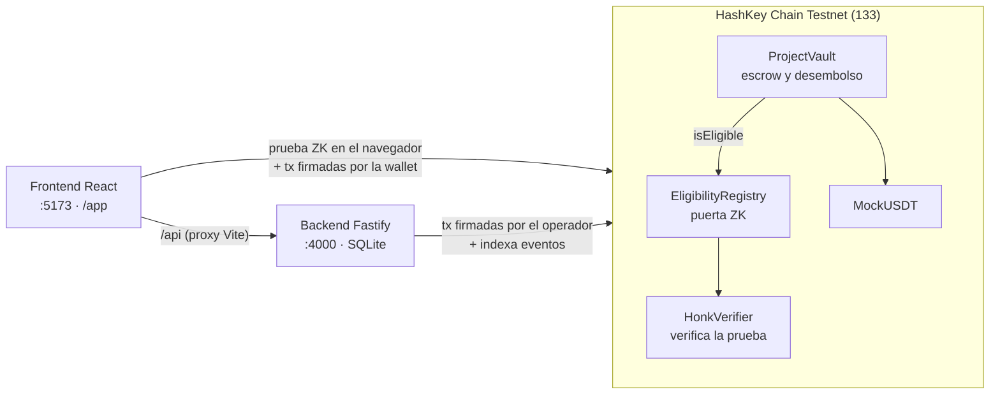
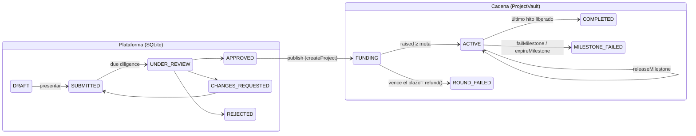
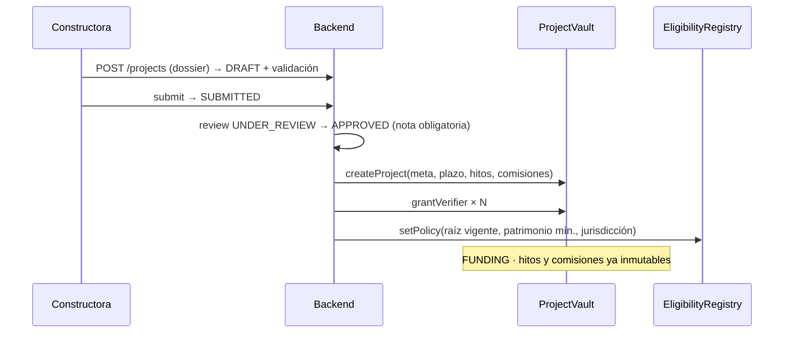
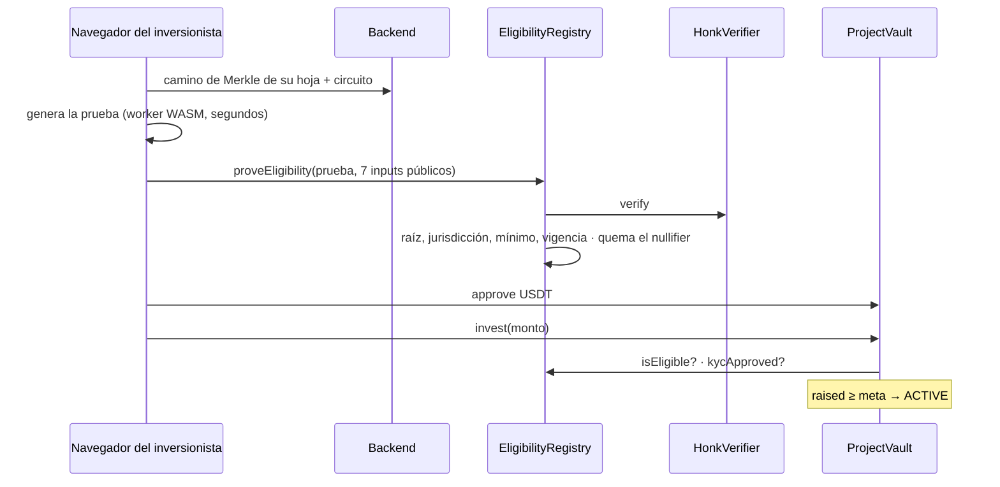
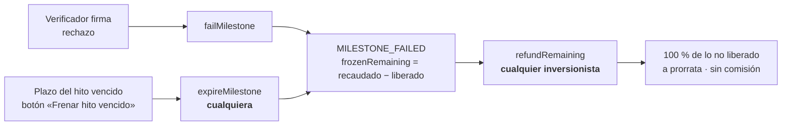

# Guía de funcionamiento para presentar Seed 2 Deed

Manual para entender los flujos de punta a punta y presentarlos sin
equivocarse. Refleja el estado del código y del despliegue en **HashKey Chain
Testnet (chainId 133)** al 13-09-2026.

Para profundizar: [`arquitectura.md`](arquitectura.md) (el porqué),
[`contratos.md`](contratos.md), [`zk.md`](zk.md), [`api.md`](api.md).
Si esta guía y el código no coinciden, manda el código.

---

## Índice

1. [El proyecto en un minuto](#1-el-proyecto-en-un-minuto)
2. [Las piezas](#2-las-piezas)
3. [Ciclo de vida de un proyecto](#3-ciclo-de-vida-de-un-proyecto)
4. [Los flujos, uno por uno](#4-los-flujos-uno-por-uno)
5. [Quién firma y quién paga gas](#5-quién-firma-y-quién-paga-gas)
6. [Qué hay hoy en testnet](#6-qué-hay-hoy-en-testnet)
7. [Preparar la demo](#7-preparar-la-demo)
8. [Guion de demo recomendado](#8-guion-de-demo-recomendado)
9. [Qué está probado](#9-qué-está-probado)
10. [Límites honestos y preguntas difíciles](#10-límites-honestos-y-preguntas-difíciles)
11. [Si algo falla en vivo](#11-si-algo-falla-en-vivo)

---

## 1. El proyecto en un minuto

**Problema.** Financiar una obra exige entregar capital hoy contra la promesa de
un edificio mañana. El inversionista no puede verificar el avance ni frenar el
desembolso si el proyecto se cae.

**Solución.** Un escrow programable en blockchain con tres garantías:

| # | Garantía | Cómo se cumple en código |
|---|----------|--------------------------|
| 1 | **El dinero sale por tramos** | `ProjectVault` libera cada hito solo contra la firma EIP-712 de un verificador independiente |
| 2 | **La elegibilidad se prueba, no se declara** | El inversionista genera una prueba de conocimiento cero (ZK) en su navegador; el contrato aprende que cumple, no su patrimonio |
| 3 | **Si algo falla, el capital no liberado vuelve** | `refundRemaining` es permissionless: nadie, ni la plataforma, puede impedirlo |

**La frase para cerrar:** el sistema controla el **desvío** de fondos, no el
**fracaso** del negocio inmobiliario. Decirlo así da credibilidad.

---

## 2. Las piezas

### 2.1 Actores

| Actor | Qué hace | En la demo |
|-------|----------|-----------|
| **Constructora** (desarrollador) | Presenta el proyecto, sube evidencia, recibe los tramos, repaga | Wallet de la constructora |
| **Operador** (Seed 2 Deed) | Cura el dossier, aprueba KYC, publica en cadena, cobra comisiones topeadas | Llave del backend (`OPERATOR_PRIVATE_KEY`) |
| **Inversionista** | Prueba elegibilidad en ZK, invierte USDT, cobra | Wallet del navegador |
| **Verificador** (LEGAL o SUPERVISOR) | Revisa la evidencia y firma aprobación o rechazo del hito | Llave pegada en `/app/verify` (solo demo) |
| **SPV** | Vehículo legal con patrimonio separado | Solo datos en el dossier |

> **Regla del contrato:** el verificador **nunca** puede ser el operador.
> `grantVerifier` revierte con `VerificadorNoPuedeSerElOperador`.

### 2.2 Capas



**Quién manda sobre qué:** el dinero y el estado de la ronda los decide la
**cadena**. El backend guarda el expediente (dossier), la evidencia y la cola de
firmas, e indexa eventos para listarlos rápido. Si el backend se cae, el capital
sigue en el vault y una firma ya emitida sigue liberando su tramo.

### 2.3 Contratos desplegados (chainId 133)

Fuente: `contracts/deployments/133.json`.

| Contrato | Dirección |
|----------|-----------|
| ProjectVault | `0xf1Da8fA04bE703cC52bc8Ac269a439111FeaD838` |
| EligibilityRegistry | `0x2820abe6f9e299CDb8Fb46Fbc1F40C4401B5d346` |
| HonkVerifier | `0x4BC765ABB1D686d1e7bEf955095A69735F42394b` |
| MockUSDT (6 decimales) | `0x3A1dFe4C26c41c34Ae7DdbCd389b722EE5d00A6D` |
| Operador y receptor de comisiones | `0x08eDd01f987bEAF8E3F40EFe7b9851d123872B45` |

Explorador: `https://testnet-explorer.hskchain.net/address/<dirección>`.

### 2.4 Cuentas demo en testnet

Direcciones públicas derivadas de las llaves de `backend/.env` (gitignoreado;
**las llaves no se comparten**). En testnet **no** se usan las cuentas de Anvil
que lista `demo-guide.md`.

| Rol | Dirección | Nota |
|-----|-----------|------|
| Constructora | `0x683F3E3E141d21d1e2d2C03CaaD9089740C6A108` | Recibe tramos de Aurora y Sacaba |
| Verificador LEGAL | `0xc7f3190F716B5b3DA7151737313F7F4019B6D919` | `DEMO_LEGAL_KEY` |
| Verificador SUPERVISOR | `0x76D502Db328B75C9050e0d2c3496aA7886937C16` | `DEMO_SUPERVISOR_KEY` |
| Inversionista A — María Fernanda (380k) | `0x955435b8eB9ff5D162E815C21dF67355e5c8040D` | |
| Inversionista B — Grupo Tunari (2,4M) | `0xe606D194a04718b80B5969689Bd10BD881E4Dbcf` | |
| Inversionista C — Joaquín Estrada (145k) | `0x7A4167b8a2033370E4A2C6aBaa6C84eCBdddF8DB` | |
| Inversionista D — Lucía Nogales (**60k**) | `0x9faee6d6064774F488A1810ad5C50b761F120673` | Existe para mostrar el rechazo ZK |

### 2.5 Dos frontends en la misma app: no mezclarlos

| Ruta | Qué es |
|------|--------|
| `/`, `/opportunities`, `/investor/*`, `/company/*`, `/admin/*` | **Maqueta** con datos simulados y login de demostración. Sirve para mostrar la visión de producto |
| **`/app/*`** | **Aplicación real**: backend + contratos en testnet. Todo número sale de la cadena |

Pestañas de `/app`:

| Pestaña | Ruta | Para quién |
|---------|------|-----------|
| Panel | `/app` | Todos: estado del capital, hitos, historial on-chain, retirar / reembolsar |
| Oportunidades | `/app/opportunities` | Inversionista: rondas con su dossier |
| Invertir | `/app/invest` | Inversionista: prueba ZK → aprobar → invertir |
| Portafolio | `/app/portfolio` | Inversionista: posiciones leídas del vault |
| Movimientos | `/app/wallet` | Saldos HSK/USDT, estado KYC on-chain, eventos |
| Identidad | `/app/identity` | Inversionista: registro, KYC, credencial ZK |
| Mis proyectos | `/app/projects` | Constructora/operador: avanzar revisión y publicar |
| Nuevo proyecto | `/app/developer/new` | Constructora: crear el dossier |
| Pagos | `/app/repayments` | Constructora: calendario y pago de cuotas |
| Verificar hitos | `/app/verify` | Verificador: evidencia, firma, transmisión |

---

## 3. Ciclo de vida de un proyecto

Dos máquinas de estado encadenadas. Hasta `PUBLISHED` manda la plataforma; desde
que existe en el vault, manda la cadena.



| Estado on-chain | Significa | Qué se puede hacer |
|-----------------|-----------|--------------------|
| `FUNDING` | Ronda abierta | `invest` (con elegibilidad y KYC) |
| `ACTIVE` | Meta alcanzada, obra en curso | Acreditar hitos, `expireMilestone` si uno venció |
| `COMPLETED` | Todo liberado | `repay` de la constructora, `claim` de inversionistas |
| `ROUND_FAILED` | No llegó a la meta a tiempo | `refund`: cada uno recupera el 100 % |
| `MILESTONE_FAILED` | Un hito se rechazó o venció | `refundRemaining`: vuelve el 100 % de lo no liberado |

---

## 4. Los flujos, uno por uno

Cada flujo indica **pantalla → qué pasa por detrás → qué decir**.

### Flujo 1 · Crear y publicar un proyecto

**Pantallas:** `/app/developer/new`, luego `/app/projects`.



1. **Guardar borrador.** El backend corre `validateDossier` y devuelve errores
   (bloqueantes) y advertencias.
2. **Presentar a revisión** → `SUBMITTED`.
3. **Revisar y aprobar (demo)** → `UNDER_REVIEW` → `APPROVED`. En producción lo
   hace el comité; toda decisión exige una nota.
4. **Publicar en cadena.** El backend, con la llave del operador, envía
   `createProject`, un `grantVerifier` por verificador y `setPolicy` con la
   **raíz del emisor vigente en ese momento**.

**Reglas que bloquean** (`packages/shared/src/validate.ts`):

- Los tramos suman exactamente 10 000 bps (100 %); ningún tramo en 0.
- Cada hito tiene evidencia exigida definida de antemano.
- Plazos de hitos crecientes, y el primero vence **después** del cierre de la ronda.
- Fuentes ≥ usos, y `meta == financiamiento de inversionistas`.
- Originación ≤ 300 bps, éxito ≤ 2000 bps (topes también en el contrato).
- Hay verificador para cada rol que exigen los hitos.
- Certificado de gravámenes verificado.

**Advertencias (no bloquean):** primer tramo > 40 %, contingencia < 5 %, aporte
del desarrollador < 10 %, gravamen de primer rango.

**Qué decir:** «Publicar es el punto sin retorno. Desde acá los hitos, la meta y
las comisiones están grabados en el vault: ni nosotros podemos cambiarlos.»

### Flujo 2 · Identidad: registro, KYC y credencial ZK

**Pantalla:** `/app/identity`, con la wallet conectada.

| Paso | Acción | Qué ocurre | Quién lo afirma |
|------|--------|-----------|-----------------|
| 1 | **Registrarme** | Crea el inversionista en la base | — |
| 2 | **Aprobar KYC (demo)** | El backend envía `setKyc(wallet, true)` al vault | **La plataforma lo afirma** (podría mentir) |
| 3 | **Emitir credencial** | El emisor crea una hoja en un árbol de Merkle (jurisdicción, patrimonio, vencimiento, secreto). El **secreto** vuelve una sola vez y se guarda en `localStorage` de ese navegador | **El inversionista lo prueba** después |

Detalles para explicar:

- El servidor conserva la **hoja** (un hash), no el secreto ni el patrimonio en
  claro dentro de la prueba.
- Borrar la credencial del navegador, o abrir otro navegador o una ventana
  privada, obliga a emitir una nueva.
- **Emitir una credencial cambia la raíz del emisor.** Las rondas ya publicadas
  guardan la raíz anterior. Ver el aviso en [§7.3](#73-el-detalle-que-rompe-la-demo-si-se-olvida).

**Qué decir:** «Son dos filtros distintos. El KYC lo afirma el operador y es su
obligación regulatoria. La elegibilidad la prueba el inversionista y nadie puede
fabricarla. Para invertir hacen falta los dos.»

### Flujo 3 · Invertir con prueba ZK

**Pantalla:** `/app/invest` (o botón **Invertir** desde una oportunidad).



1. **Generar prueba y registrar.** La prueba demuestra, sin revelar datos, que la
   credencial está en el árbol publicado, que la jurisdicción coincide, que el
   patrimonio alcanza el mínimo y que no venció. El `now` se toma del **bloque**,
   no del reloj de la computadora.
2. **Aprobar USDT** para que el vault pueda mover el token.
3. **Invertir.** El USDT entra al **vault**, no a la constructora.

Casos a mostrar:

- **Rechazo sin revelar:** una credencial con patrimonio menor al mínimo (Lucía,
  60k frente a 100k) **no puede generar la prueba**. La plataforma nunca ve
  cuánto tiene; solo que no alcanza.
- **Nullifier:** la misma credencial no se registra dos veces en la misma ronda.
  En otra ronda el nullifier es distinto.
- **Sin prueba**, `invest` revierte con `ElegibilidadRequerida`.
- **Faucet (+10.000):** mint de USDT de prueba desde la wallet.

**Qué decir:** «El contrato sabe que cumplo. No sabe mi patrimonio, ni mi
identidad, ni cuál de las credenciales vigentes es la mía.»

### Flujo 4 · Acreditar y liberar un hito

**Pantalla:** `/app/verify`. Solo funciona con el proyecto en `ACTIVE`.

Tres actos que la interfaz mantiene separados a propósito:

| Acto | Quién | Qué pasa |
|------|-------|----------|
| **Subir evidencia** | Constructora | El backend calcula el `sha256` sobre los bytes recibidos (no acepta el del cliente). Se arma el **hash del paquete** del hito |
| **Firmar** | Verificador del rol correcto | Firma EIP-712 de `{projectId, milestoneIndex, evidenceHash, approved, nonce, expiresAt}`. **No lleva monto**: el tramo se fijó al publicar |
| **Transmitir** | **Cualquiera** | `releaseMilestone` (aprobado) o `failMilestone` (rechazado). El contrato autoriza por la **firma**, no por quién envía la tx |

Al liberar: el vault calcula `tramo = recaudado × bps / 10 000`, descuenta la
comisión de originación (≤ 3 %) hacia el operador y envía el resto a la
constructora.

Protecciones que se pueden mencionar:

- `Firmar aprobación` se deshabilita si falta evidencia pactada.
- Un LEGAL no puede acreditar un hito de SUPERVISOR (`FirmanteNoAutorizado`).
- Cambiar un archivo de evidencia cambia el hash y la firma deja de valer.
- En la demo, la llave del verificador se pega en un campo. En producción la
  firma sale de la wallet del verificador. **Decirlo antes de que lo pregunten.**

**Qué decir:** «Si Seed 2 Deed desaparece mañana, una firma ya emitida sigue
liberando su tramo. El backend es una comodidad, no una llave.»

### Flujo 5 · El freno: hito rechazado o vencido

**Pantallas:** `/app/verify` para el rechazo, `/app` (Panel) para el reembolso.



- `expireMilestone` solo funciona si el plazo del hito en turno ya pasó; si no,
  revierte.
- En el Panel aparece **Recuperar capital no liberado** cuando el estado es
  `MILESTONE_FAILED`.
- Lo ya liberado está en la obra y no vuelve. Lo que queda en el vault vuelve
  entero.

**Ejemplo real en testnet (Condominio Sacaba):** meta 200.000 USDT, hito 0 (30 %)
liberado = 60.000; hito 1 rechazado por el supervisor → 140.000 congelados →
devueltos a prorrata: A (120k invertidos) recibe 84.000, B (80k) recibe 56.000.

**Qué decir:** «Cualquier plataforma muestra que el dinero entra. Lo que importa
es qué pasa cuando algo sale mal: acá el capital vuelve sin pedirle permiso a
nadie.»

### Flujo 6 · Repago y cobro

**Pantallas:** `/app/repayments` (constructora), `/app` o `/app/portfolio` (inversionista).

1. **Generar calendario** de cuotas (se guarda en el backend).
2. **Pagar** una cuota desde la wallet: `approve` USDT si hace falta → `repay` al
   vault. Luego el backend **verifica el recibo** (tx exitosa, dirigida al vault,
   evento `Repaid` de ese proyecto por al menos el monto) antes de marcarla
   pagada.
3. El vault reparte a prorrata. La **comisión de éxito se cobra solo sobre el
   retorno**, nunca sobre el capital: mientras no se devolvió todo el capital, la
   plataforma cobra 0.
4. Cada inversionista pulsa **Retirar** (`claim`).

**Ejemplo real en testnet (Edificio Aurora):**

| Concepto | USDT |
|----------|------|
| Recaudado (A 300k + B 400k + C 200k) | 900.000 |
| Comisión de originación 2 % sobre tramos | 18.000 |
| Recibido por la constructora | 882.000 |
| Repago: capital + 12 % | 1.008.000 |
| Comisión de éxito 15 % sobre el retorno (108.000) | 16.200 |
| Repartido a inversionistas | 991.800 |

La primera cuota fue solo capital (450.000) y la comisión cobrada fue **0**.

### Flujo 7 · Ronda que no llega a la meta

Si vence `fundingDeadline` en `FUNDING` sin alcanzar la meta, cualquier
inversionista llama `refund` y recupera el 100 %. Estado `ROUND_FAILED`. No hay
proyecto en este estado en testnet; se explica, no se muestra.

---

## 5. Quién firma y quién paga gas

| Transacción | Firma | Paga gas |
|-------------|-------|----------|
| `createProject`, `grantVerifier`, `setPolicy` (publicar) | Operador (backend) | Operador |
| `setKyc` (Aprobar KYC) | Operador (backend) | Operador |
| `releaseMilestone` / `failMilestone` desde `/app/verify` | Firma: verificador (sin gas). Envío: operador | Operador |
| `proveEligibility` | Wallet del inversionista | Inversionista (~3 M de gas, lo más caro) |
| `approve`, `invest`, `claim`, `refundRemaining` | Wallet del inversionista | Inversionista |
| `faucet` de MockUSDT | Wallet conectada | Esa wallet |
| `repay` desde `/app/repayments` | Wallet conectada | Esa wallet |
| `expireMilestone` desde el Panel | Wallet conectada | Esa wallet |

Consecuencias prácticas:

- La wallet del navegador necesita **HSK de testnet** para gas, además de USDT
  (que sale del faucet).
- El verificador **no necesita gas**: solo firma.
- El operador tenía **~0,035 HSK** tras las pruebas. Un `seed` + `e2e` completo
  cuesta ~0,015 HSK. Publicar un proyecto son 4 tx o más; conviene recargar al
  operador antes de la presentación.

---

## 6. Qué hay hoy en testnet

Consultado al backend en ejecución:

| Proyecto | onChainId | Estado on-chain | Sirve para mostrar |
|----------|-----------|-----------------|--------------------|
| **Edificio Aurora** | 2 | `COMPLETED` · 900.000 recaudados | Camino feliz completo: 5 hitos, repago, cobros, historial |
| **Condominio Sacaba** (escenario de fracaso) | 3 | `MILESTONE_FAILED` · 200.000 recaudados | El freno y el reembolso |
| Prueba de conexión | 4 | `FUNDING` · 0 | Proyecto técnico creado por `check:conn`; no usar en la demo |
| Prueba de conexión | 5 | `FUNDING` · 0 | Ídem |

**No hay hoy una ronda "presentable" abierta.** Para mostrar una inversión en
vivo hay que publicar una (ver §7.4).

---

## 7. Preparar la demo

### 7.1 Levantar todo

```bash
# Desde la raíz del repo. backend/.env y frontend/.env ya apuntan a 133.
npm install
npm run dev:backend      # :4000
npm run dev:frontend     # :5173  → abrir http://localhost:5173/app
```

Verificaciones rápidas:

```bash
npm run check:conn       # 27/27 esperado (usa el proxy de Vite)
npm run fund:demo        # recarga HSK a las cuentas demo hasta un piso; idempotente
```

> No correr `npm run seed -- --reset` ni `npm run e2e` antes de presentar sin
> motivo: consumen HSK del operador (~0,015 por corrida) y crean proyectos nuevos.

### 7.2 Checklist

- [ ] Backend y frontend corriendo; `/app` muestra «Red 133 · vault 0xf1Da…».
- [ ] Wallet (MetaMask) en HashKey Chain Testnet; el botón de wallet ofrece
      agregar o cambiar de red si hace falta.
- [ ] La wallet del inversionista tiene HSK para gas (~0,01 HSK por prueba ZK
      con margen).
- [ ] El operador tiene HSK suficiente (verlo en la salida de `npm run fund:demo`).
- [ ] Mismo navegador y perfil durante toda la demo (la credencial vive en
      `localStorage`).
- [ ] Llaves de `DEMO_LEGAL_KEY` y `DEMO_SUPERVISOR_KEY` a mano, sin proyectarlas.
- [ ] Pestañas abiertas de antemano: Panel con Aurora, Panel con Sacaba, Identidad.

### 7.3 El detalle que rompe la demo si se olvida

**Emitir una credencial en `/app/identity` cambia la raíz del emisor.** Una ronda
ya publicada guarda la raíz anterior, y `proveEligibility` revierte con
`RaizNoCoincide()`.

Dos formas de evitarlo:

- **Orden correcto (recomendado):** primero emitir la credencial del
  inversionista, **después** publicar el proyecto donde va a invertir. Publicar
  toma la raíz vigente.
- **Republicar la raíz** de una ronda existente:

  ```bash
  curl -X POST http://127.0.0.1:4000/api/issuer/publish/<onChainId> \
    -H 'content-type: application/json' \
    -d '{"minNetWorth":"100000","jurisdiction":68}'
  ```

### 7.4 Preparar una ronda pequeña para invertir y liberar en vivo

Para que una sola wallet cierre la ronda con el faucet y se pueda liberar un hito
en vivo, en `/app/developer/new`:

| Campo | Valor sugerido | Por qué |
|-------|----------------|---------|
| Meta de la ronda | `10000` | El faucet da 10.000 USDT por llamada |
| Aporte del desarrollador | `500000` (por defecto) | Fuentes ≥ usos |
| Terreno / Construcción | `260000` / `240000` | Fuentes ≥ usos; la diferencia va a contingencia |
| Ticket mínimo | `1000` | |
| Wallet de la constructora | la conectada, o `0x683F…A108` | Recibe los tramos |
| Verificador legal | `0xc7f3190F716B5b3DA7151737313F7F4019B6D919` | Tener su llave para firmar |
| Supervisor de obra | `0x76D502Db328B75C9050e0d2c3496aA7886937C16` | Ídem |
| Patrimonio mínimo / Jurisdicción | `100000` / Bolivia (68) | |

Luego **Guardar borrador → Presentar → Revisar y aprobar → Publicar en cadena**.
Publicar tarda más que en local: cada tx espera 2 confirmaciones.

Secuencia completa antes de presentar (ensayarla una vez):

1. Wallet del inversionista → `/app/identity`: registrarse, aprobar KYC, emitir
   credencial con patrimonio ≥ 100.000 y jurisdicción Bolivia.
2. `/app/developer/new`: crear y publicar la ronda pequeña.
3. Confirmar en `/app/opportunities` que aparece en `FUNDING`.

---

## 8. Guion de demo recomendado

Diseñado para que lo más importante **no dependa** de transacciones en vivo:
Aurora y Sacaba ya ocurrieron en cadena.

| Min | Pantalla | Acción | Mensaje |
|-----|----------|--------|---------|
| 0:00 | `/` (maqueta) | Mostrar la visión de producto | «Así lo ve un usuario final. Ahora, lo que está en cadena.» |
| 0:45 | `/app` → Aurora | Estado del capital, 5 hitos liberados, historial | «Cada número tiene un hash de transacción. 900.000 entraron, salieron por tramos contra firmas, y se repagaron 991.800 netos.» |
| 2:00 | `/app/opportunities/<Aurora>` | Verificadores, gravamen declarado, comisiones | «La hipoteca de primer rango está a la vista antes de invertir.» |
| 3:00 | `/app/identity` | Mostrar las 3 tarjetas | «El KYC lo afirma la plataforma; la credencial la prueba el inversionista.» |
| 4:00 | `/app/invest` → ronda pequeña | Generar prueba → aprobar → invertir | «La prueba se generó en este navegador. El contrato no conoce mi patrimonio.» |
| 6:00 | `/app` → ronda pequeña | Estado `ACTIVE`, «sigue en el escrow» | «El dinero está en el vault, no en la cuenta de la constructora.» |
| 6:30 | `/app/verify` | Subir evidencia → firmar como LEGAL → transmitir | «Firma el hash de la evidencia, no un texto libre. La tx la puede enviar cualquiera.» |
| 8:00 | `/app` → Sacaba | `MILESTONE_FAILED`, 140.000 congelados y devueltos | **El momento clave:** «El supervisor rechazó el hito. El capital no liberado volvió al 100 %, sin nuestra firma ni comisión.» |
| 9:30 | — | Cierre | «Controlamos el desvío de fondos. El riesgo del negocio sigue existiendo, y lo decimos.» |

**Plan B** si la red o la wallet fallan en el minuto 4 a 8: saltar directo a
Sacaba y Aurora, que ya están en cadena, y abrir las transacciones en el
explorador.

**Variante para jueces técnicos:** mostrar la terminal con la salida de un
`npm run e2e` grabado antes (no correrlo en vivo: tarda y consume gas).

---

## 9. Qué está probado

Resultados de la configuración de HashKey Testnet:

| Verificación | Resultado |
|--------------|-----------|
| `seed` | KYC aprobado on-chain para 4 inversionistas, USDT de prueba acuñado, proyecto publicado (`createProject` → `grantVerifier` → `setPolicy`) |
| `e2e` completo | **Pasó.** Pruebas ZK verificadas por `HonkVerifier` a través del registro; `invest` bloqueado por el registro; credencial reutilizada rechazada; 5 hitos liberados con firma de verificadores; repago y cobros cuadran exacto; el reembolso del hito fallido devolvió el 100 % del capital congelado |
| `check:conn` | 27/27 a través del proxy de Vite, incluida la publicación de un proyecto desde la API |
| `kyc-check` | Pasó: el KYC llega a la cadena |
| Type-check backend y build del frontend | Pasan |
| Tests de contratos y circuito | 30 y 6 tests (`npm run contracts:test`, `npm run circuit:test`) |

Problemas propios de red pública que se corrigieron:

1. **`unknown account`:** seed, e2e y 8 llamadas de la API pedían al RPC que
   firmara (Anvil lo hace, un nodo público no). Ahora firman localmente.
2. **Nonces repetidos** en transacciones seguidas: el backend lleva el nonce.
3. **Lecturas desactualizadas:** el RPC está detrás de Cloudflare y una lectura
   justo después de una tx confirmada podía caer en un nodo atrasado (hacía
   revertir `invest` tras `approve`). En redes reales se esperan **2
   confirmaciones** (~2 s más por tx).
4. El `e2e` elige un `onChainId` libre en el vault; el indexador lee logs en
   bloques de 50k.

---

## 10. Límites honestos y preguntas difíciles

### Lo que es de demo y hay que decir

| Aspecto | En la demo | En producción |
|---------|-----------|---------------|
| KYC | Botón «Aprobar KYC (demo)» | Proveedor KYC tras revisar documentos |
| Firma del verificador | Llave pegada en un formulario | Firma desde la wallet del verificador |
| Llave del operador | Variable de entorno del backend | KMS o multisig |
| Autenticación de la API | **No hay** | Login con wallet (SIWE) y roles |
| Secreto de la credencial | Lo genera el backend y se guarda en `localStorage` | Generado y cifrado en el dispositivo |
| USDT | MockUSDT con faucet libre | Token real |
| Evidencia | Guardada en el backend; IPFS opcional | Almacenamiento con integridad verificable |
| Explorador | Contratos **sin verificar** (se ven las tx, no el código fuente) | Verificar contra `testnet-explorer.hskchain.net` |

### Preguntas probables

**¿Qué pasa si el verificador desaparece?** Cualquiera llama `expireMilestone`
cuando vence el plazo; el capital no liberado queda disponible para
`refundRemaining`.

**¿Y si el operador se vuelve malicioso?** No hay función `withdraw` ni proxy
actualizable, las comisiones tienen tope en el bytecode, no puede designarse
verificador ni fabricar una prueba ZK. Sí puede aprobar KYC falso: por eso existe
el segundo filtro.

**¿Cómo gana dinero la plataforma?** Originación ≤ 3 % sobre cada tramo liberado
y éxito ≤ 20 % solo sobre el retorno. En un reembolso cobra 0.

**¿Por qué ZK y no una base de datos?** La plataforma no necesita conocer el
patrimonio para aplicar la regla, y el contrato puede exigirla sin confiar en
nadie.

**¿El inmueble queda tokenizado o registrado?** No. La propiedad sigue en
Derechos Reales; en cadena va el escrow y hashes de documentos.

**¿Y si la constructora no repaga?** Es riesgo de crédito y ningún contrato lo
elimina. El sistema reduce el riesgo de desvío, no el de negocio.

**¿Qué recibe legalmente el inversionista?** Decisión abierta (deuda,
participación o revenue share). El modelo ya distingue `BULLET`,
`QUARTERLY_INTEREST` y `ON_SALE`.

---

## 11. Si algo falla en vivo

| Síntoma | Causa probable | Qué hacer |
|---------|----------------|-----------|
| Banner «No hay contratos disponibles» | Backend caído o red distinta | Revisar `npm run dev:backend`; `VITE_CHAIN_ID` y `CHAIN_ID` deben ser 133 |
| Aviso de red equivocada en la wallet | MetaMask en otra red | Usar el botón para cambiar a HashKey Testnet |
| `RaizNoCoincide()` al registrar la prueba | Se emitió una credencial después de publicar la ronda | Republicar la raíz (§7.3) |
| «No hay credencial guardada en este navegador» | Otro navegador, ventana privada o credencial borrada | Emitir una nueva en `/app/identity` (y republicar la raíz) |
| El circuito no genera prueba y lista problemas | Patrimonio bajo el mínimo, jurisdicción distinta o vencida | Es el comportamiento esperado (caso Lucía) |
| `ElegibilidadRequerida` al invertir | No se registró la prueba en esa ronda | Hacer el paso 1 de `/app/invest` |
| Error de gas o «insufficient funds» | Wallet sin HSK | Enviarle HSK; `npm run fund:demo` recarga solo las cuentas demo |
| Publicar falla a mitad de camino | Operador sin HSK | Recargar al operador y reintentar |
| «Los hitos solo se acreditan con la ronda cerrada» | Proyecto aún en `FUNDING` | Completar la meta primero |
| `FirmanteNoAutorizado()` | Llave del rol equivocado | LEGAL firma hitos LEGAL; SUPERVISOR, los de obra |
| «Frenar hito vencido» revierte | El plazo del hito no pasó | Normal; mostrar Sacaba en su lugar |
| Un saldo no se actualiza enseguida | RPC detrás de Cloudflare | Pulsar **Actualizar** tras unos segundos |
