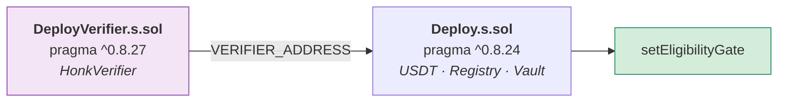

# Operación

## 1. Requisitos

| Herramienta | Versión | Para qué | Instalación |
|-------------|---------|----------|-------------|
| Node | ≥ 20 (probado en 26.5) | Backend, packages, frontend | |
| Foundry | `forge` 1.8+ | Contratos | `curl -L https://foundry.paradigm.xyz \| bash && foundryup` |
| Noir | `1.0.0-beta.26` | Circuito *(solo si lo recompilás)* | `curl -L https://raw.githubusercontent.com/noir-lang/noirup/main/install \| bash && noirup` |
| Barretenberg | `5.2.0` | Verificador *(idem)* | `curl -L https://raw.githubusercontent.com/AztecProtocol/aztec-packages/master/barretenberg/bbup/install \| bash && bbup -v 5.2.0` |

El verificador Solidity ya está commiteado, así que **Noir y bb no hacen falta**
para levantar la demo — solo para modificar el circuito.

---

## 2. Levantar la demo

La red la deciden dos archivos gitignoreados: `backend/.env` (`CHAIN_ID`) y
`frontend/.env` (`VITE_CHAIN_ID`). **Tienen que coincidir.** Sin ellos, todo
apunta a Anvil (31337). Plantillas: `backend/.env.example` y
`frontend/.env.example`.

### 2.1 HashKey Chain Testnet (133): donde está desplegado hoy

Los contratos ya están desplegados (`contracts/deployments/133.json`) y la base
ya está sembrada. Para usar la demo solo hace falta levantar las aplicaciones:

```bash
npm install
npm run dev:backend    # :4000
npm run dev:frontend   # :5173  → http://localhost:5173/app
npm run check:conn     # opcional: 27 verificaciones por el proxy de Vite
```

Desde cero (cuesta HSK de testnet; ver §4 y §6):

```bash
cp backend/.env.example backend/.env      # completar OPERATOR_PRIVATE_KEY y DEMO_*_KEY
cp frontend/.env.example frontend/.env
npm run contracts:deploy:hashkey          # requiere contracts/.env con PRIVATE_KEY
npm run fund:demo                         # gas para las cuentas demo
npm run seed -- --reset
npm run e2e
```

> En testnet la cadena **no se reinicia**. `seed -- --reset` limpia la base
> local, pero el vault conserva los proyectos anteriores. Seed y e2e buscan
> solos un `onChainId` libre.

### 2.2 Anvil local

Con `CHAIN_ID=31337` y `VITE_CHAIN_ID=31337` (o sin los `.env`):

```bash
npm install

npm run chain                    # terminal 1 — Anvil en :8545
npm run contracts:deploy:local   # terminal 2
npm run seed -- --reset
npm run e2e

npm run dev:backend    # :4000
npm run dev:frontend   # :5173
```

### En los dos casos

`npm run seed` imprime las credenciales ZK de los cuatro inversionistas de demo
y las vuelca en `backend/data/demo-credentials.json` (gitignoreado).

---

## 3. Comandos

| Comando | Qué hace |
|---------|----------|
| `npm run chain` | Anvil, chainId 31337, bloques cada 2 s |
| `npm run contracts:build` | `forge build` |
| `npm run contracts:test` | 30 tests |
| `npm run contracts:deploy:local` | Despliega los 4 contratos y escribe `deployments/31337.json` |
| `npm run contracts:deploy:hashkey` | Despliega en HashKey Chain Testnet y escribe `deployments/133.json` (`NETWORK=mainnet` para 177) |
| `npm run fund:demo` | Recarga HSK a las cuentas demo hasta un piso por rol. Correrlo dos veces no envía dos veces. En Anvil no hace nada |
| `npm run circuit:test` | 6 tests del circuito |
| `npm run circuit:build` | Recompila el circuito **y regenera el verificador** |
| `npm run seed -- --reset` | Limpia la base y siembra la demo |
| `npm run e2e` | Flujo completo contra la cadena |
| `npm run check:conn` | 27 verificaciones frontend ↔ backend ↔ cadena por el proxy de Vite (con backend y frontend corriendo) |
| `node backend/scripts/kyc-check.mjs` | Alta de un inversionista de punta a punta: registro → KYC on-chain → credencial |
| `npm run build` | Compila los 4 workspaces |
| `node scripts/sync-abi.mjs` | Regenera los ABIs tipados desde `contracts/out` |

---

## 4. Despliegue

### Por qué el despliegue son dos pasos



El verificador que genera barretenberg exige `^0.8.27`. `ProjectVault` está
clavado en `0.8.24` — **lo que se audita es un bytecode concreto**, no «lo que
compile hoy». Dos pragmas incompatibles no conviven en una misma unidad de
compilación.

Queda de paso una separación que igual queríamos: cambiar el circuito obliga a
desplegar verificador y registro nuevos, **pero no un vault nuevo**. Un vault con
capital adentro no se migra — se lo reapunta con `setEligibilityGate`.

### Local

```bash
npm run contracts:deploy:local
```

### HashKey Chain

```bash
# contracts/.env
PRIVATE_KEY=0x…        # llave del desplegador; queda como operador
# opcionales: OPERATOR, FEE_RECIPIENT, HSK_RPC_URL,
#             USDT_ADDRESS (si falta, despliega un MockUSDT)

npm run contracts:deploy:hashkey                                # testnet (133)
cd contracts && NETWORK=mainnet bash script/deploy-hashkey.sh   # mainnet (177)
```

`contracts/script/deploy-hashkey.sh` hace, en orden:

1. Comprueba que el RPC responde con el chainId esperado, antes de gastar gas.
2. `DeployVerifier.s.sol` → `deployments/verifier-<chainId>.json`.
3. `Deploy.s.sol` con `VERIFIER_ADDRESS` → `deployments/<chainId>.json`.
4. Intenta verificar los contratos en Blockscout (sin API key).

Después, `OPERATOR_PRIVATE_KEY` en `backend/.env` tiene que ser **la misma**
`PRIVATE_KEY`: solo el operador puede crear proyectos, dar KYC y fijar políticas.

> ⚠️ **Verificación en el explorador pendiente.** El script apunta a
> `testnet-explorer.hsk.xyz`, que redirige a `testnet-explorer.hskchain.net`, y
> la petición de verificación no sigue la redirección. Los contratos funcionan,
> pero el explorador no muestra su código fuente. Hay que re-verificarlos con
> `forge verify-contract` apuntando a `https://testnet-explorer.hskchain.net/api/`.

### Otra red EVM

Mismo esquema de dos pasos, a mano. El script anterior para Avalanche Fuji
quedó en `contracts/script/legacy/deploy-fuji.sh`.

```bash
cd contracts
export PRIVATE_KEY=0x…              # llave del desplegador
export OPERATOR=0x…                 # opcional; por defecto, el desplegador
export FEE_RECIPIENT=0x…            # opcional
export USDT_ADDRESS=0x…             # opcional; si falta, despliega un MockUSDT
export RPC=https://…

forge script script/DeployVerifier.s.sol --rpc-url $RPC --broadcast
export VERIFIER_ADDRESS=$(jq -r .verifier deployments/verifier-<chainId>.json)
forge script script/Deploy.s.sol --rpc-url $RPC --broadcast
```

La red tiene que estar en `packages/shared/src/chain.ts`:

| chainId | Red | Explorador | Estado |
|---------|-----|------------|--------|
| 31337 | Anvil local | — | Desarrollo |
| **133** | **HashKey Chain Testnet** | testnet-explorer.hskchain.net | **Desplegado hoy** |
| 177 | HashKey Chain | hashkey.blockscout.com | Configurada, sin desplegar |
| 43113 | Avalanche Fuji | snowtrace | Despliegue anterior (legacy) |
| 84532 | Base Sepolia | basescan | Configurada |
| 11155111 | Ethereum Sepolia | etherscan | Configurada |

> El verificador usa `mcopy` (**Cancun**). Todas estas redes lo soportan; una
> red anterior no podría desplegarlo.

### Direcciones

`contracts/deployments/<chainId>.json`. Backend y frontend leen de ahí: **nadie
copia direcciones a mano**, que es como se termina apuntando la UI a un vault
viejo sin notarlo.

---

## 5. Configuración

Los scripts npm del backend cargan `backend/.env` solos
(`node --env-file-if-exists=.env`).

**Backend** (`backend/.env`):

| Variable | Default | En HashKey Testnet |
|----------|---------|--------------------|
| `PORT` | `4000` | |
| `HOST` | `127.0.0.1` | |
| `CHAIN_ID` | `31337` | `133` |
| `RPC_URL` | `http://127.0.0.1:8545` | `https://testnet.hsk.xyz` |
| `DB_PATH` | `backend/data/seed2deed.db` | |
| `CORS_ORIGINS` | `http://localhost:5173,…` | |
| `OPERATOR_PRIVATE_KEY` | cuenta 0 de Anvil | La llave que desplegó los contratos. Ver abajo |
| `DEMO_DEVELOPER_KEY` … `DEMO_INVESTOR_D_KEY` | llaves de Anvil | 7 llaves propias. Ver §6 |
| `PINATA_JWT` | — | Opcional: anclar evidencia en IPFS |

**Frontend** (`frontend/.env`):

| Variable | Default | En HashKey Testnet |
|----------|---------|--------------------|
| `VITE_CHAIN_ID` | `31337` | `133`. Tiene que ser igual a `CHAIN_ID` |
| `VITE_RPC_URL` | el de `packages/shared/src/chain.ts` | `https://testnet.hsk.xyz` |

Fuera de Anvil, el backend espera **2 confirmaciones** por transacción (en Anvil,
1). El RPC público está detrás de Cloudflare, y una lectura justo después de una
tx confirmada puede caer en un nodo que todavía no la vio.

### ⚠️ La llave del operador

En local es la cuenta 0 de Anvil, cuyo mnemónico es **público y está en la
documentación de Foundry**: cualquiera en el mundo tiene esa llave. En testnet
es la llave del desplegador, guardada en `backend/.env`.

En producción esto **no** es una variable de entorno con una llave adentro: es
una firma delegada a un KMS o a una multisig. Un backend que puede firmar como
operador y además está expuesto a internet es **un único servidor comprometido de
distancia** respecto de poder crear proyectos falsos.

`.gitignore` bloquea `.env*`, `*.key`, `*.pem`, `keystore/` y `backend/data/`.

---

## 6. Cuentas de la demo

`backend/src/demo-accounts.ts` elige las cuentas según la red:

- **Anvil (31337):** las cuentas determinísticas de Foundry. Su mnemónico es
  público.
- **Cualquier otra red:** el operador es `OPERATOR_PRIVATE_KEY` y cada rol lee su
  llave de `DEMO_<ROL>_KEY` en `backend/.env`. Si falta alguna, avisa y usa la de
  Anvil. **En una red pública eso es un error:** los bots vacían en segundos el
  gas que se mande a esas direcciones.

Generar llaves: `cast wallet new`. Darles gas: `npm run fund:demo`.

| Rol | Anvil | HashKey Testnet (133) |
|-----|-------|-----------------------|
| Operador / tesorería | #0 `0xf39Fd6e5…` | `0x08eDd01f987bEAF8E3F40EFe7b9851d123872B45` |
| Constructora | #1 `0x70997970…` | `0x683F3E3E141d21d1e2d2C03CaaD9089740C6A108` |
| Verificador LEGAL | #2 `0x3C44CdDd…` | `0xc7f3190F716B5b3DA7151737313F7F4019B6D919` |
| Verificador SUPERVISOR | #3 `0x90F79bf6…` | `0x76D502Db328B75C9050e0d2c3496aA7886937C16` |
| Inversionista A — 380k | #4 `0x15d34AAf…` | `0x955435b8eB9ff5D162E815C21dF67355e5c8040D` |
| Inversionista B — 2,4M | #5 `0x9965507D…` | `0xe606D194a04718b80B5969689Bd10BD881E4Dbcf` |
| Inversionista C — 145k | #6 `0x976EA740…` | `0x7A4167b8a2033370E4A2C6aBaa6C84eCBdddF8DB` |
| Inversionista D — **60k** | #7 `0x14dC7996…` | `0x9faee6d6064774F488A1810ad5C50b761F120673` |

Pisos de gas de `fund:demo` (HSK): inversionistas A y B 0,012 (prueban dos
veces) · C 0,006 · constructora 0,005 · supervisor 0,002 · legal y D 0,001. Un
`seed` + `e2e` completo le cuesta al operador unos 0,015 HSK; la mayor parte son
las pruebas ZK (~3 M de gas cada `proveEligibility`).

**D existe para demostrar el rechazo**: tiene KYC aprobado y aun así el circuito
no le deja generar una prueba, porque su patrimonio no alcanza el mínimo de la
ronda — sin que su patrimonio se revele en ningún lado.

---

## 7. Qué corre el `e2e`

```text
ESCENARIO A — camino feliz
  ├─ Lucía Nogales rechazada (patrimonio insuficiente, sin revelarlo)
  ├─ 3 inversionistas: prueba ZK → proveEligibility → invest
  ├─ Rechazo del segundo intento con la misma credencial (nullifier quemado)
  ├─ Ronda cierra en 900.000 USDT → ACTIVE
  ├─ 5 hitos liberados contra firmas de DOS verificadores distintos
  │    assert: constructora + comisión == recaudado
  ├─ Repago en dos cuotas
  │    assert: comisión de éxito == 0 sobre la cuota de solo capital
  └─ claim() a prorrata — 0 unidades de polvo de redondeo

ESCENARIO B — el freno
  ├─ Proyecto 2, mismas credenciales, nullifiers distintos
  ├─ Hito 0 acreditado → libera 30 %
  ├─ Hito 1 RECHAZADO por el supervisor → MILESTONE_FAILED
  └─ refundRemaining: 100 % de lo no liberado, a prorrata, sin comisión
       assert: ninguna transacción necesitó la firma del operador
```

El escenario B es el que importa. Cualquier plataforma puede demostrar que el
dinero entra; **lo que hay que demostrar es qué pasa cuando algo sale mal**.

En testnet el `e2e` corre igual, pero es más lento (2 confirmaciones por tx) y
consume HSK. La última corrida en la red 133 pasó completa y dejó en cadena a
**Edificio Aurora** (`COMPLETED`) y **Condominio Sacaba** (`MILESTONE_FAILED`).

---

## 8. Troubleshooting

| Síntoma | Causa | Solución |
|---------|-------|----------|
| `No hay despliegue para la red <chainId>` | Falta `contracts/deployments/<chainId>.json`, o `CHAIN_ID` apunta a otra red | Local: `npm run contracts:deploy:local` · HashKey: `npm run contracts:deploy:hashkey` |
| `No hay nodo en <RPC_URL>` | Anvil caído, o RPC público caído | Local: `npm run chain` · testnet: `cast chain-id --rpc-url https://testnet.hsk.xyz` |
| `El circuito no está compilado` (`503`) | Falta `eligibility.json` | `npm run circuit:build` |
| `no hay proyecto sembrado` | Base vacía | `npm run seed -- --reset` |
| `PruebaVencida()` al probar elegibilidad | `now` fuera de la ventana de 30 min | Tomar `now` del **bloque**, no del reloj del host |
| `PruebaInvalida()` con prueba que verifica local | `verifierTarget` ≠ `evm`, o verificador de otra versión del circuito | Regenerar con `npm run circuit:build` y redesplegar |
| `RaizNoCoincide()` | La raíz del emisor cambió tras emitir o revocar | `POST /api/issuer/publish/:onChainId` |
| `FirmanteNoAutorizado()` | El rol del firmante no coincide con el del hito | Un LEGAL no acredita avance de obra |
| `HitosInvalidos()` al publicar | Σ bps ≠ 10 000 | Lo detecta antes `POST /submit` |
| `ERR_UNSUPPORTED_TYPESCRIPT_SYNTAX` | Type-stripping de Node no soporta parameter properties ni enums | Declarar los campos aparte |
| `Found incompatible versions` en `forge build` | Choque de pragmas | No importar el verificador desde un archivo con pragma `0.8.24` |
| Anvil reiniciado y el backend sirve datos viejos | La base sobrevive; la cadena no | `npm run seed -- --reset` tras redesplegar |
| La UI avisa de red equivocada | `VITE_CHAIN_ID` ≠ `CHAIN_ID`, o la wallet está en otra red | Igualar los `.env` y reiniciar Vite; cambiar de red desde el botón de wallet |
| `[demo] Red 133: faltan DEMO_…_KEY` | Faltan llaves en `backend/.env` | `cast wallet new` y `npm run fund:demo` |
| `insufficient funds` en seed, e2e o al publicar | El operador o una cuenta demo sin HSK | Recargar al operador; `npm run fund:demo` para las cuentas demo |
| `unknown account` | Se le pidió al RPC público que firme (Anvil lo hace, un nodo público no) | Firmar localmente con una cuenta de viem; seed, e2e y API ya lo hacen |
| `RaizNoCoincide()` justo después de emitir una credencial en la UI | Emitir cambia la raíz; la ronda guarda la anterior | `POST /api/issuer/publish/:onChainId`, o publicar la ronda después de emitir |
| Revert justo después de un `approve` confirmado | Lectura servida por un nodo atrasado del RPC | El backend ya espera 2 confirmaciones; en la UI, reintentar tras unos segundos |

### Reset completo (solo Anvil)

En testnet la cadena no se resetea: `npm run seed -- --reset` limpia la base local
y crea el proyecto con otro `onChainId`; los anteriores siguen en el vault.

```bash
pkill -f anvil
rm -rf backend/data contracts/deployments contracts/broadcast
npm run chain &
sleep 3
npm run contracts:deploy:local
npm run seed -- --reset
npm run e2e
```

---

## 9. Checklist antes de producción

La demo ya corre en una testnet pública, pero sin valor real. Todo lo de abajo
sigue pendiente antes de mainnet:

- [ ] Auth por wallet (SIWE) y autorización por rol en la API — **hoy no hay ninguna**
- [ ] Llave del operador en KMS o multisig, nunca en una env var
- [ ] Firmas de verificadores desde su propia wallet, no con `verifierKey` en el cuerpo
- [ ] Auditoría externa de `ProjectVault` y `EligibilityRegistry`
- [ ] Rate limiting
- [ ] Secreto de la credencial generado en el dispositivo del titular
- [ ] Evidencia en IPFS o almacenamiento con integridad verificable (T18)
- [ ] Migrar SQLite → Postgres si hace falta concurrencia real
- [ ] Encuadre regulatorio: definir qué recibe el inversionista a cambio de su USDT
- [ ] Postularse al Entorno Controlado de Pruebas de ASFI
