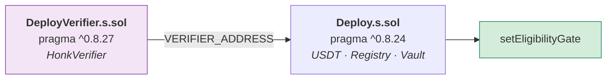

# Operación

## 1. Requisitos

| Herramienta | Versión | Para qué | Instalación |
|-------------|---------|----------|-------------|
| Node | ≥ 20 (probado en 26.5) | Backend, packages, frontend | |
| Foundry | `forge` 1.8+ | Contratos | `curl -L https://foundry.paradigm.xyz \| bash && foundryup` |
| Noir | `1.0.0-beta.26` | Circuito *(solo si lo recompilás)* | `curl -L https://raw.githubusercontent.com/noir-lang/noirup/main/install \| bash && noirup` |
| Barretenberg | `5.2.0` | Verificador *(idem)* | `curl -L https://raw.githubusercontent.com/AztecProtocol/aztec-packages/master/barretenberg/bbup/install \| bash && bbup -v 5.2.0` |

El verificador Solidity ya está commiteado, así que **Noir y bb no hacen falta**
para levantar la demo — solo para modificar el circuito.

---

## 2. Levantar la demo

```bash
npm install

npm run chain                    # terminal 1 — Anvil en :8545
npm run contracts:deploy:local   # terminal 2
npm run seed -- --reset
npm run e2e
```

Al terminar, `npm run seed` imprime las credenciales ZK de los cuatro
inversionistas de demo y las vuelca en `backend/data/demo-credentials.json`
(gitignoreado).

```bash
npm run dev:backend    # :4000
npm run dev:frontend   # :5173
```

---

## 3. Comandos

| Comando | Qué hace |
|---------|----------|
| `npm run chain` | Anvil, chainId 31337, bloques cada 2 s |
| `npm run contracts:build` | `forge build` |
| `npm run contracts:test` | 30 tests |
| `npm run contracts:deploy:local` | Despliega los 4 contratos y escribe `deployments/31337.json` |
| `npm run circuit:test` | 6 tests del circuito |
| `npm run circuit:build` | Recompila el circuito **y regenera el verificador** |
| `npm run seed -- --reset` | Limpia la base y siembra la demo |
| `npm run e2e` | Flujo completo contra la cadena |
| `npm run build` | Compila los 4 workspaces |
| `node scripts/sync-abi.mjs` | Regenera los ABIs tipados desde `contracts/out` |

---

## 4. Despliegue

### Por qué el despliegue son dos pasos



El verificador que genera barretenberg exige `^0.8.27`. `ProjectVault` está
clavado en `0.8.24` — **lo que se audita es un bytecode concreto**, no «lo que
compile hoy». Dos pragmas incompatibles no conviven en una misma unidad de
compilación.

Queda de paso una separación que igual queríamos: cambiar el circuito obliga a
desplegar verificador y registro nuevos, **pero no un vault nuevo**. Un vault con
capital adentro no se migra — se lo reapunta con `setEligibilityGate`.

### Local

```bash
npm run contracts:deploy:local
```

### Testnet

```bash
cd contracts
export PRIVATE_KEY=0x…              # llave del desplegador
export OPERATOR=0x…                 # opcional; por defecto, el desplegador
export FEE_RECIPIENT=0x…            # opcional
export USDT_ADDRESS=0x…             # opcional; si falta, despliega un MockUSDT
export RPC=https://api.avax-test.network/ext/bc/C/rpc

forge script script/DeployVerifier.s.sol --rpc-url $RPC --broadcast
export VERIFIER_ADDRESS=$(python3 -c "import json;print(json.load(open('deployments/verifier-43113.json'))['verifier'])")
forge script script/Deploy.s.sol --rpc-url $RPC --broadcast
```

Redes configuradas en `packages/shared/src/chain.ts`:

| chainId | Red | Explorador |
|---------|-----|------------|
| 31337 | Anvil local | — |
| 43113 | Avalanche Fuji | snowtrace |
| 84532 | Base Sepolia | basescan |
| 11155111 | Ethereum Sepolia | etherscan |

> El verificador usa `mcopy` (**Cancun**). Las cuatro lo soportan; una red
> anterior no podría desplegarlo.

### Direcciones

`contracts/deployments/<chainId>.json`. Backend y frontend leen de ahí: **nadie
copia direcciones a mano**, que es como se termina apuntando la UI a un vault
viejo sin notarlo.

---

## 5. Configuración

| Variable | Default | Nota |
|----------|---------|------|
| `PORT` | `4000` | |
| `HOST` | `127.0.0.1` | |
| `CHAIN_ID` | `31337` | |
| `RPC_URL` | `http://127.0.0.1:8545` | |
| `DB_PATH` | `backend/data/seed2deed.db` | |
| `CORS_ORIGINS` | `http://localhost:5173,…` | |
| `OPERATOR_PRIVATE_KEY` | cuenta 0 de Anvil | ver abajo |

### ⚠️ La llave del operador

En local es la cuenta 0 de Anvil, cuyo mnemónico es **público y está en la
documentación de Foundry**: cualquiera en el mundo tiene esa llave.

En producción esto **no** es una variable de entorno con una llave adentro: es
una firma delegada a un KMS o a una multisig. Un backend que puede firmar como
operador y además está expuesto a internet es **un único servidor comprometido de
distancia** respecto de poder crear proyectos falsos.

`.gitignore` bloquea `.env*`, `*.key`, `*.pem`, `keystore/` y `backend/data/`.

---

## 6. Cuentas de la demo

`backend/src/demo-accounts.ts` — las diez determinísticas de Anvil.

| Rol | Cuenta | Dirección |
|-----|--------|-----------|
| Operador / tesorería | #0 | `0xf39Fd6e5…` |
| Constructora | #1 | `0x70997970…` |
| Verificador LEGAL | #2 | `0x3C44CdDd…` |
| Verificador SUPERVISOR | #3 | `0x90F79bf6…` |
| Inversionista A — 380k | #4 | `0x15d34AAf…` |
| Inversionista B — 2,4M | #5 | `0x9965507D…` |
| Inversionista C — 145k | #6 | `0x976EA740…` |
| Inversionista D — **60k** | #7 | `0x14dC7996…` |

**D existe para demostrar el rechazo**: tiene KYC aprobado y aun así el circuito
no le deja generar una prueba, porque su patrimonio no alcanza el mínimo de la
ronda — sin que su patrimonio se revele en ningún lado.

---

## 7. Qué corre el `e2e`

```text
ESCENARIO A — camino feliz
  ├─ Lucía Nogales rechazada (patrimonio insuficiente, sin revelarlo)
  ├─ 3 inversionistas: prueba ZK → proveEligibility → invest
  ├─ Rechazo del segundo intento con la misma credencial (nullifier quemado)
  ├─ Ronda cierra en 900.000 USDT → ACTIVE
  ├─ 5 hitos liberados contra firmas de DOS verificadores distintos
  │    assert: constructora + comisión == recaudado
  ├─ Repago en dos cuotas
  │    assert: comisión de éxito == 0 sobre la cuota de solo capital
  └─ claim() a prorrata — 0 unidades de polvo de redondeo

ESCENARIO B — el freno
  ├─ Proyecto 2, mismas credenciales, nullifiers distintos
  ├─ Hito 0 acreditado → libera 30 %
  ├─ Hito 1 RECHAZADO por el supervisor → MILESTONE_FAILED
  └─ refundRemaining: 100 % de lo no liberado, a prorrata, sin comisión
       assert: ninguna transacción necesitó la firma del operador
```

El escenario B es el que importa. Cualquier plataforma puede demostrar que el
dinero entra; **lo que hay que demostrar es qué pasa cuando algo sale mal**.

---

## 8. Troubleshooting

| Síntoma | Causa | Solución |
|---------|-------|----------|
| `No hay despliegue para la red 31337` | Falta desplegar | `npm run contracts:deploy:local` |
| `No hay nodo en http://127.0.0.1:8545` | Anvil caído | `npm run chain` |
| `El circuito no está compilado` (`503`) | Falta `eligibility.json` | `npm run circuit:build` |
| `no hay proyecto sembrado` | Base vacía | `npm run seed -- --reset` |
| `PruebaVencida()` al probar elegibilidad | `now` fuera de la ventana de 30 min | Tomar `now` del **bloque**, no del reloj del host |
| `PruebaInvalida()` con prueba que verifica local | `verifierTarget` ≠ `evm`, o verificador de otra versión del circuito | Regenerar con `npm run circuit:build` y redesplegar |
| `RaizNoCoincide()` | La raíz del emisor cambió tras emitir o revocar | `POST /api/issuer/publish/:onChainId` |
| `FirmanteNoAutorizado()` | El rol del firmante no coincide con el del hito | Un LEGAL no acredita avance de obra |
| `HitosInvalidos()` al publicar | Σ bps ≠ 10 000 | Lo detecta antes `POST /submit` |
| `ERR_UNSUPPORTED_TYPESCRIPT_SYNTAX` | Type-stripping de Node no soporta parameter properties ni enums | Declarar los campos aparte |
| `Found incompatible versions` en `forge build` | Choque de pragmas | No importar el verificador desde un archivo con pragma `0.8.24` |
| Anvil reiniciado y el backend sirve datos viejos | La base sobrevive; la cadena no | `npm run seed -- --reset` tras redesplegar |

### Reset completo

```bash
pkill -f anvil
rm -rf backend/data contracts/deployments contracts/broadcast
npm run chain &
sleep 3
npm run contracts:deploy:local
npm run seed -- --reset
npm run e2e
```

---

## 9. Checklist antes de una red pública

- [ ] Auth por wallet (SIWE) y autorización por rol en la API — **hoy no hay ninguna**
- [ ] Llave del operador en KMS o multisig, nunca en una env var
- [ ] Firmas de verificadores desde su propia wallet, no con `verifierKey` en el cuerpo
- [ ] Auditoría externa de `ProjectVault` y `EligibilityRegistry`
- [ ] Rate limiting
- [ ] Secreto de la credencial generado en el dispositivo del titular
- [ ] Evidencia en IPFS o almacenamiento con integridad verificable (T18)
- [ ] Migrar SQLite → Postgres si hace falta concurrencia real
- [ ] Encuadre regulatorio: definir qué recibe el inversionista a cambio de su USDT
- [ ] Postularse al Entorno Controlado de Pruebas de ASFI
