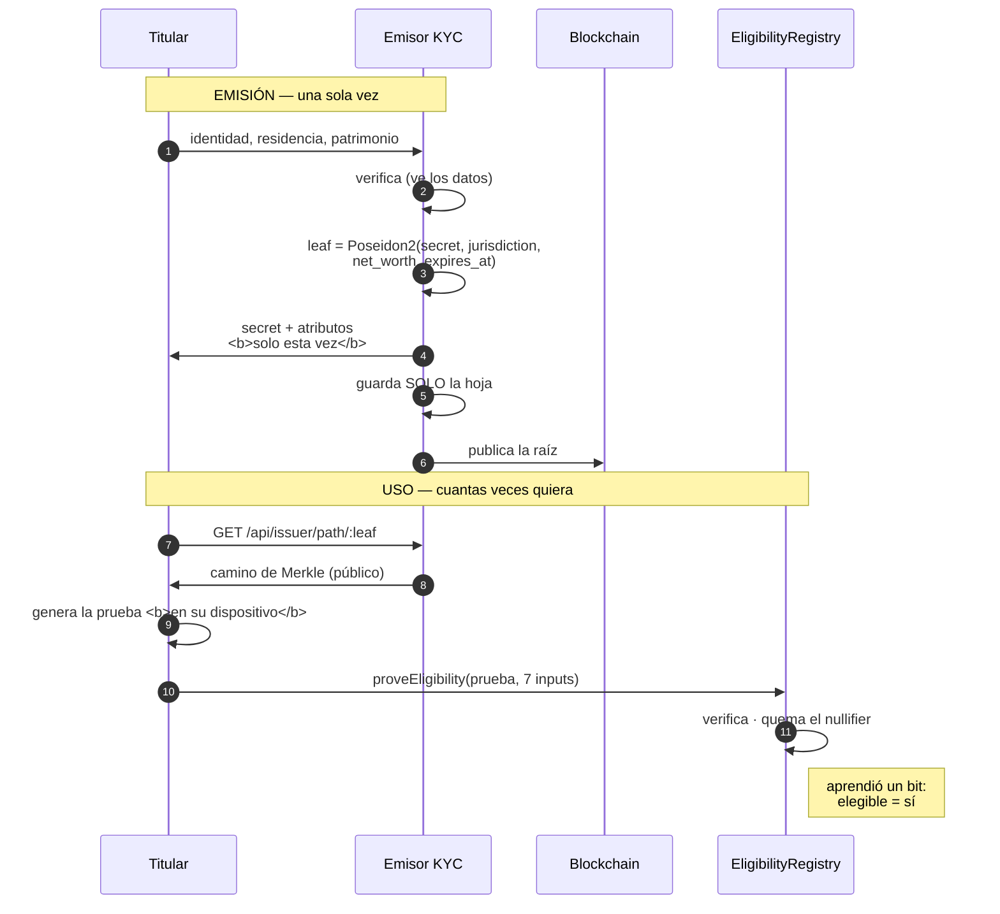

# Capa de conocimiento cero

## 1. La tensión que resuelve

Seed 2 Deed es un intermediario y tiene que responder por quién entra a una
ronda: jurisdicción admitida, patrimonio suficiente, credencial KYC vigente y no
revocada.

Demostrar eso a la manera habitual exige que alguien —la plataforma, el contrato,
el explorador de bloques— vea el CI, el domicilio y el patrimonio del
inversionista. En una cadena pública eso es indefendible, y en varias
jurisdicciones, directamente ilegal.

```text
   ANTES                                  ACÁ
   ─────────────────────────────          ───────────────────────────────
   "Confiá en que revisamos"       →      prueba matemática verificable
   la plataforma ve todo           →      la plataforma ve un bit
   el explorador ve todo           →      el explorador ve un nullifier
   revocar = mantener una lista    →      revocar = republicar la raíz
```

El contrato aprende **un bit**: cumple o no cumple.

---

## 2. Stack

| Pieza | Versión | Rol |
|-------|---------|-----|
| Noir | `1.0.0-beta.26` | Lenguaje del circuito |
| `noir-lang/poseidon` | `v0.3.0` | Poseidon2 — salió de la stdlib en la 1.0 |
| Barretenberg (`bb`) | `5.2.0` | Prover/verifier UltraHonk |
| `@aztec/bb.js` | `5.2.0` | Mismo prover, en JS |
| `@noir-lang/noir_js` | `1.0.0-beta.26-40d6574.nightly` | Ejecuta el ACIR |

> El nightly de `noir_js` está clavado al **hash de commit exacto** de `nargo`
> (`40d6574`). Con versiones que no calzan, el ACIR ejecuta mal y el síntoma es
> indescifrable.

---

## 3. El modelo, en una línea

> El emisor KYC publica una **raíz**; el inversionista guarda un **secreto**.



**El servidor no guarda el secreto ni los atributos.** Si el titular los pierde,
se re-emite; no hay recuperación. Eso es la propiedad, no el defecto: **lo que el
servidor no tiene no se le puede filtrar, ni pedir por orden judicial, ni
vender.**

---

## 4. El circuito

`circuits/eligibility/src/main.nr` · `TREE_DEPTH = 8` (256 credenciales por raíz)

### Las cinco restricciones

```solidity
// 1 · La credencial está viva en el árbol del emisor
leaf = Poseidon2([secret, jurisdiction, net_worth, expires_at], 4)
assert(compute_merkle_root(leaf, path, bits) == credential_root)

// 2 · No venció  — comparación en u64, no en Field
assert(expires_at as u64 > now as u64)

// 3 · Jurisdicción admitida
assert(jurisdiction == allowed_jurisdiction)

// 4 · Patrimonio suficiente — se prueba el UMBRAL, no la cifra
assert(net_worth as u64 >= min_net_worth as u64)

// 5 · Nullifier atado al secreto, al proyecto y a la wallet
assert(nullifier == Poseidon2([secret, project_id, investor_address], 3))
```

### Por qué cada una está escrita así

**La hoja compromete los cuatro atributos.** Cambiar uno solo —subirse el
patrimonio, por ejemplo— produce otra hoja y rompe la inclusión.

**La comparación va en `u64`, no en `Field`.** Sobre un `Field` crudo la resta da
la vuelta módulo *p* y `>` deja de significar lo que parece.

**El orden importa en el árbol.** `hash(a,b) ≠ hash(b,a)`; sin la selección
izquierda/derecha, un camino podría validarse contra una raíz que no le
corresponde.

**La restricción 5 es la que ata `investor_address`.** Un input público que no
participa de ninguna restricción **lo puede fijar el atacante a su antojo**:
la prueba seguiría siendo válida. Meterlo en el nullifier lo obliga a participar.

### Inclusión = emitida **y** no revocada

```text
   revocar  =  sacar la hoja  +  republicar la raíz
                      │
                      ▼
         la prueba de inclusión ya no cierra
```

No hace falta una lista de revocación ni una prueba de no-pertenencia. Es el
**mismo mecanismo** para ambas propiedades, y por eso es difícil de romper por
descuido.

En SQL, revocar pone la hoja en `0`. **No se compacta el array**: mover las demás
invalidaría el camino de autenticación de todos los otros titulares.

### El nullifier

```text
   nullifier = Poseidon2(secret, project_id, investor_address)
```

| Propiedad | Consecuencia |
|-----------|--------------|
| Determinista para un mismo trío | El contrato puede quemarlo → una entrada por ronda |
| Distinto por proyecto | Los nullifiers de dos rondas **no son correlacionables** sin el secreto |
| Incluye la wallet | Una prueba robada del mempool no sirve con otra dirección |

El `e2e` lo demuestra: las mismas credenciales entran a la ronda 2 sin que nadie
pueda atarlas a su participación en la ronda 1.

### Tests del circuito

```bash
npm run circuit:test    # 6 tests
```

| Test | Qué cubre |
|------|-----------|
| `elegible_pasa` | Camino feliz |
| `patrimonio_por_debajo_del_minimo_falla` | Restricción 4 |
| `credencial_vencida_falla` | Restricción 2 |
| `jurisdiccion_distinta_falla` | Restricción 3 |
| `credencial_fuera_del_arbol_falla` | Restricción 1 |
| `prueba_robada_del_mempool_no_sirve_con_otra_wallet` | Restricción 5 |

---

## 5. Los 7 inputs públicos

| # | Nombre | Quién lo fija | Atado a |
|---|--------|---------------|---------|
| 0 | `credential_root` | El emisor | `Policy.credentialRoot` |
| 1 | `project_id` | La ronda | El `projectId` del llamado |
| 2 | `investor_address` | El titular | `msg.sender` |
| 3 | `min_net_worth` | La ronda | `Policy.minNetWorth` |
| 4 | `allowed_jurisdiction` | La ronda | `Policy.allowedJurisdiction` |
| 5 | `now` | El prover | Ventana de ±30/5 min |
| 6 | `nullifier` | El circuito | Se quema |

### Un contrato implícito entre tres archivos

El orden **no lo verifica ningún compilador**. Si alguien reordena la firma de
`main`, el registro compara la jurisdicción contra el patrimonio y acepta
cualquier cosa.

```text
   circuits/eligibility/src/main.nr        ← la firma de main()
   contracts/src/EligibilityRegistry.sol   ← constantes PI_*
   packages/zk/src/prove.ts                ← toCircuitInputs()
```

Están nombradas en los tres lados justamente para que el error salte al leerlo.

### Por qué `now` lo acota el contrato

El circuito compara la credencial contra un `now` que **elige el prover**. Sin
acotarlo, bastaría con probar «en enero de 2020 yo era elegible» para entrar hoy
con una credencial vencida hace años.

Hacia el futuro se tolera poco: un `now` futuro solo *endurece* la condición de
vencimiento, pero un reloj corrido no debería pasar.

---

## 6. Generar una prueba

`packages/zk/src/prove.ts` — **corre igual en Node y en el navegador**, y ese
detalle es el punto entero del diseño: la prueba se genera **donde está el
secreto**. Si el backend la generara, el backend tendría que conocer el
patrimonio, y toda la privacidad sería un adorno.

```ts
import { initPoseidon, generateEligibilityProof } from '@s2d/zk';

await initPoseidon();

const proof = await generateEligibilityProof(circuit, {
  credential: { secret, jurisdiction: 68, netWorth: 380_000n, expiresAt },
  merkleProof,                 // de GET /api/issuer/path/:leaf
  projectId: 1,
  investorAddress: '0x15d3…',
  minNetWorth: 100_000n,
  allowedJurisdiction: 68,
  now,                         // del bloque, no del reloj del host
});

// → { proof: '0x…', publicInputs: [7 × Hex], nullifier: '0x…' }
```

### Chequeo previo, en castellano

`checkEligibilityLocally` valida las condiciones **antes** de gastar segundos
probando:

```text
✗ La credencial venció el 2025-03-14.
✗ La ronda admite la jurisdicción 68 y la credencial declara 32.
✗ La ronda exige un patrimonio mínimo de 100000 y la credencial acredita menos.
```

El circuito ya valida todo esto, pero un `assert` fallido adentro devuelve un
error opaco de barretenberg. El inversionista se entera de que su credencial
venció en castellano, en vez de mirar un stack trace de WASM.

### `verifierTarget: 'evm'`

```ts
backend.generateProof(witness, { verifierTarget: 'evm' })
```

`'evm'` = keccak como oráculo de Fiat-Shamir + ZK. Tiene que ser **exactamente**
el mismo target con el que se generó el verificador Solidity (`bb … -t evm`);
con otro, la prueba es válida pero el contrato la rechaza.

---

## 7. Poseidon2: una sola implementación

El árbol se arma en TypeScript y se verifica dentro del circuito. Si las dos
implementaciones de Poseidon2 no coinciden **bit por bit**, ninguna prueba valida
jamás.

Por eso `packages/zk/src/poseidon.ts` **no reimplementa nada**: llama a la misma
barretenberg que Noir usa por debajo, vía `BarretenbergSync.poseidon2Hash`.

```ts
const { hash } = sync.poseidon2Hash({ inputs: inputs.map(toBytes32) });
```

### Conversiones de campo

Casi todo bug de integración ZK vive acá: un byte al revés, un hex sin padear, un
número que pasó por `Number` y perdió precisión.

```text
   Noir     Field           elemento de BN254, ~254 bits
   EVM      bytes32         big-endian, 256 bits
   bb.js    Uint8Array(32)  big-endian
```

Todo concentrado en `packages/zk/src/field.ts`, un módulo chico y probado.

---

## 8. Regenerar el verificador

```bash
npm run circuit:build
```

Equivale a:

```bash
cd circuits/eligibility
nargo compile
bb write_vk -b target/eligibility.json -o target/vk -t evm
bb write_solidity_verifier -k target/vk/vk \
   -o ../../contracts/src/verifiers/EligibilityVerifier.sol -t evm
```

> ⚠️ **Cambiar el circuito obliga a desplegar un verificador y un registro
> nuevos — pero NO un vault nuevo.** Un vault con capital adentro no se migra.
> Por eso `setEligibilityGate` es un paso separado y rehacible.

El artefacto compilado se sirve por `GET /api/circuit/eligibility` en vez de
empaquetarse en el bundle del frontend, para que sea **siempre** el mismo con el
que se generó el verificador desplegado. Un `eligibility.json` viejo produce
pruebas válidas que el contrato rechaza, y ese es un síntoma horrible de depurar.

---

## 9. Números reales

Medidos en la máquina de desarrollo, circuito de 4.096 gates:

| Operación | Tiempo |
|-----------|--------|
| Generar la prueba (Node, en frío) | ~4,4 s |
| Generar la prueba (Node, WASM caliente) | ~180 ms |
| Verificar localmente | < 100 ms |
| `verify` on-chain | una llamada `view` |

| Artefacto | Tamaño |
|-----------|--------|
| Prueba | 7.232 bytes |
| Inputs públicos | 7 × 32 bytes |
| Verificador Solidity | 2.491 líneas · ~18,5 KB de bytecode |

El verificador usa `mcopy`, que es de **Cancun**. Anvil, HashKey Chain (donde
está desplegado hoy), Avalanche C-Chain y Base lo soportan; una red anterior no
podría desplegarlo.

---

## 10. Lo que esta capa NO resuelve

| Limitación | Detalle |
|------------|---------|
| El emisor ve los datos al emitir | Inevitable: alguien tiene que verificar el KYC. Lo que se evita es que los **guarde** y que la **cadena** los vea |
| El secreto lo genera el servidor en la demo | En producción lo genera el dispositivo del titular y el emisor recibe un compromiso |
| El camino de Merkle revela la posición | No el contenido. Y quien lo pide ya conoce su propia hoja |
| 256 credenciales por raíz | `TREE_DEPTH = 8`. Subirlo a 20 da un millón, a costa de gates |
| Correlación por patrón de gasto | El nullifier no correlaciona, pero los montos y los tiempos en cadena sí pueden |
